# Chatbot & MLOps

#### 講者：陳奎銘 `Benjamin Chen`

---

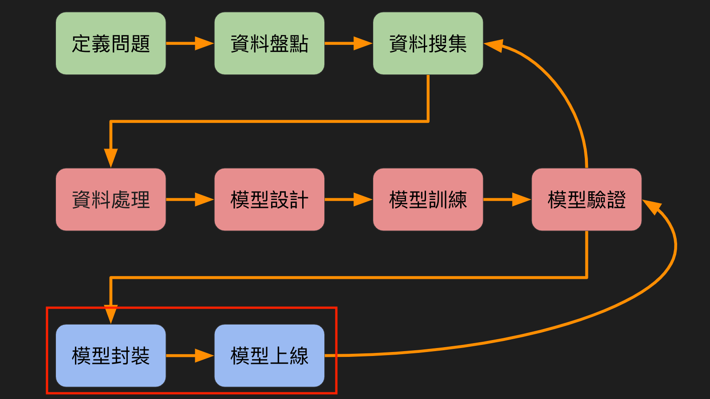

---

# Chatbot

----

## 今天就是先實作一波吧

----


---

# Github

https://github.com/

點選右上角的Sign Up <!-- .element: class="fragment" data-fragment-index="1" -->

----

## 從填寫 email 開始

<!-- .slide: data-background="media/github_1.png" -->


----

<!-- .slide: data-background="media/github_2.png" -->


----


<!-- .slide: data-background="media/github_3.png" -->

<font size=7 color="#FFFFFF" style="position: absolute; top: 600px; left: 50px">確認你不是機器人
</font>

----

<!-- .slide: data-background="media/github_4.png" -->


----


<!-- .slide: data-background="media/github_5.png" -->


----


<!-- .slide: data-background="media/github_6.png" -->

<font size=7 color="#FFFFFF" style="position: absolute; top: 600px; left: 50px">收信取得確認碼
</font>


----

## 進入 
https://github.com/KuiMing/heroku_linebot

----


<!-- .slide: data-background="media/github_7.png" -->

## 按下`Fork`


----


<!-- .slide: data-background="media/github_8.png" -->


<font size=7 color="#FFFFFF" style="position: absolute; top: 600px; left: 50px">選擇自己的帳號，然後 Create Fork</font>

---


# Heroku

----

## 申請帳號

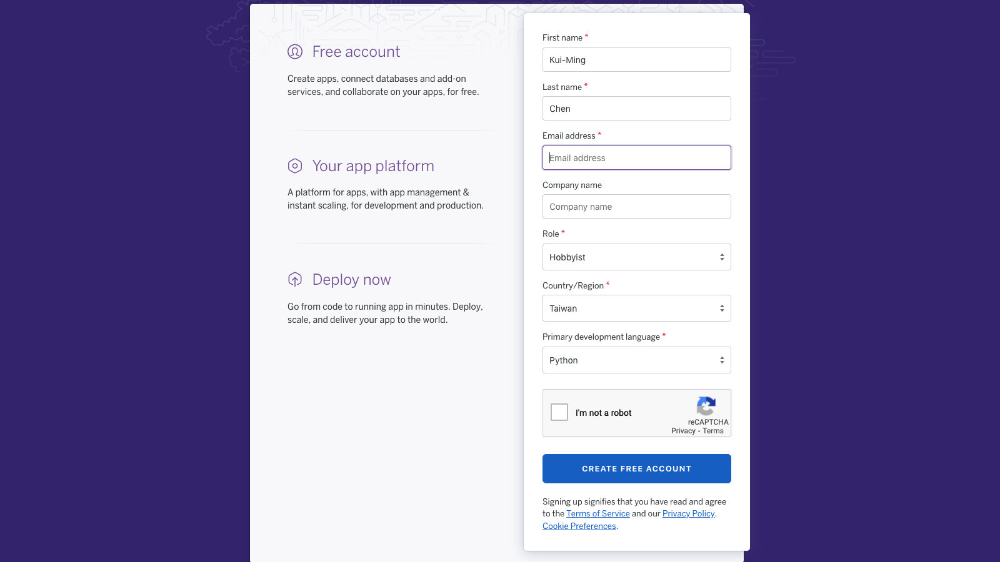


----

## 申請成功之後

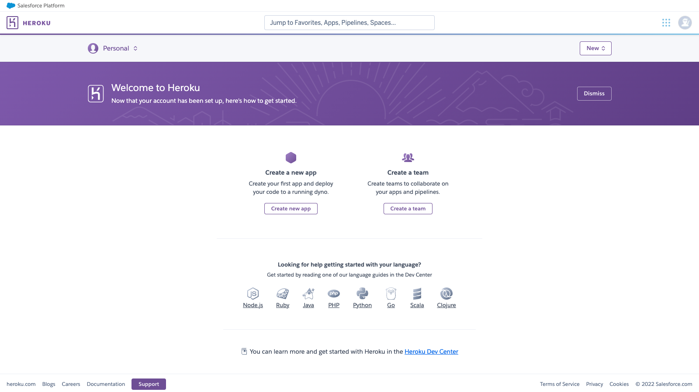

----

## Create a New App

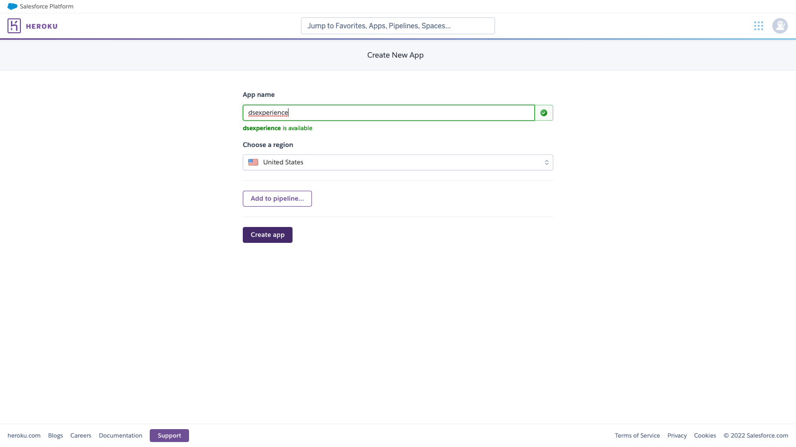

----

## Github


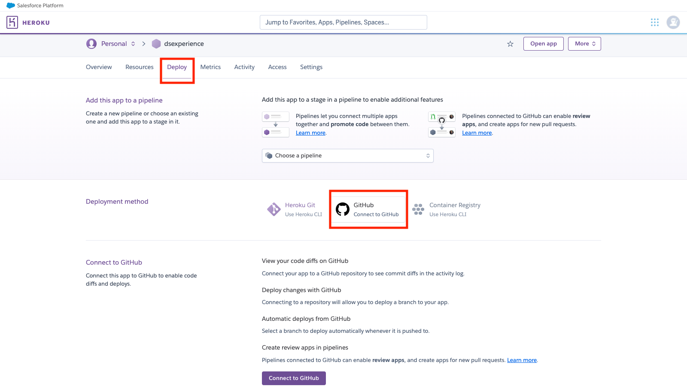


----

## Connect to Github

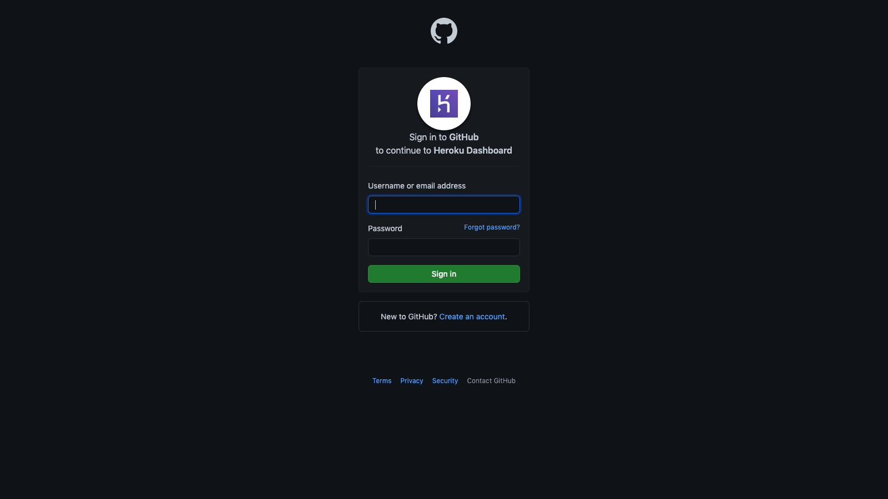


----


## Authorize Heroku

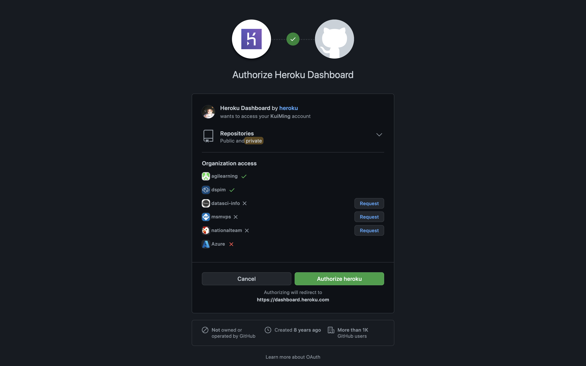


----

## Connect to repository

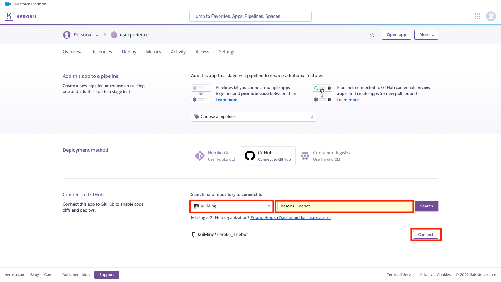


----

## Choose a branch to Deploy

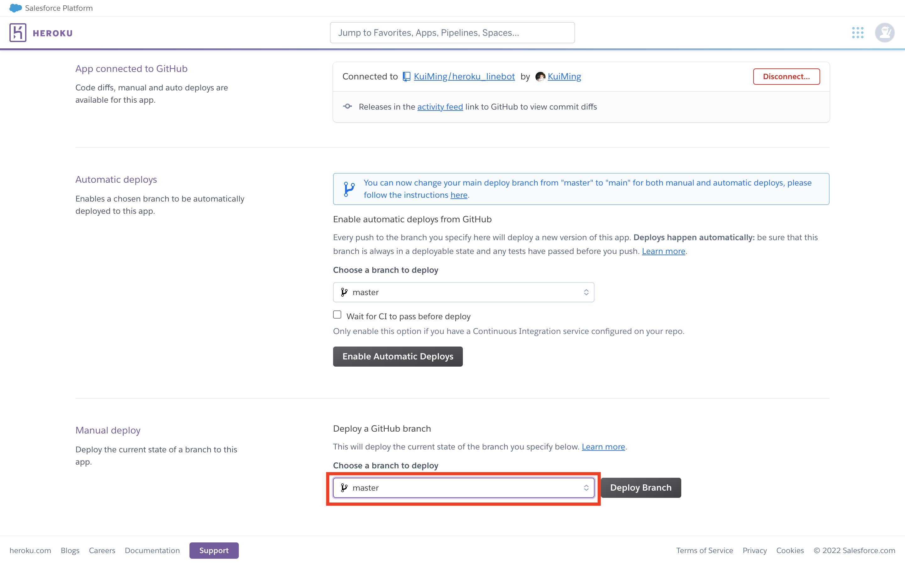

----

**Choose "hello" and Deploy**


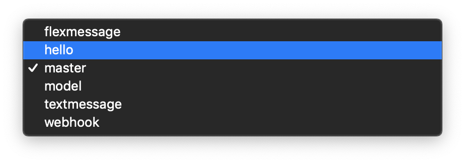


----

## Build App

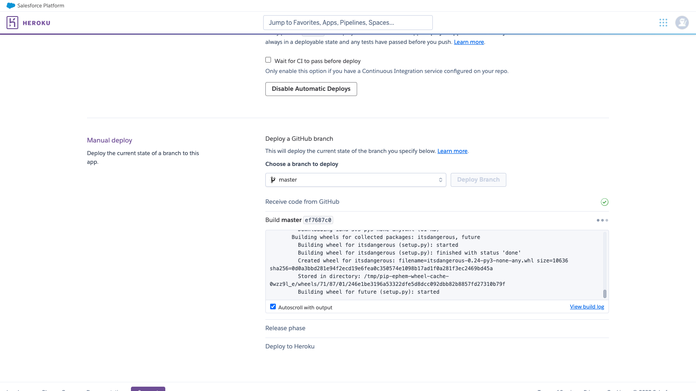


----

## Sccessfully Deployed

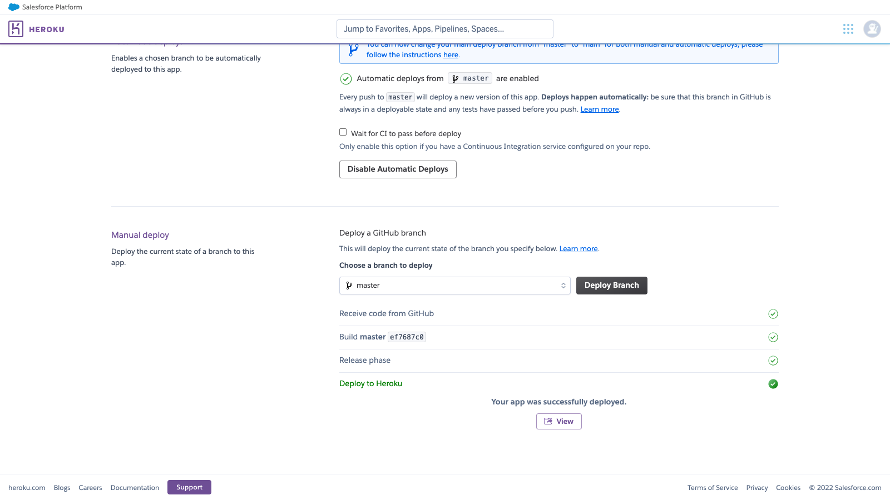


----

## Open Web Application


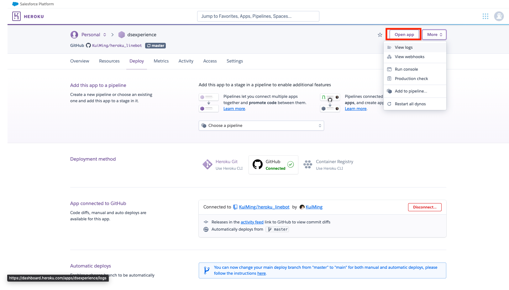


```
Hello World!!!!!
```


----

## Flask

```python
from flask import Flask
APP = Flask(__name__)

@APP.route("/")
def hello() -> str:
    "hello world"
    return "Hello World!!!!!"

if __name__ == "__main__":
    APP.run(debug=True)
```

---


# Line Messaging API


----


## How it works

- 使用者發送訊息到 LINE chatbot 帳號
- LINE Platform 發送 `webhook event` 到 bot server
- bot server 透過 LINE Platform 回應給使用者

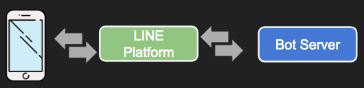

----

## 建立 Messaging API channel
- 進入 https://account.line.biz/login
- 使用 LINE 帳號登入
- 找到 Providers
  - 按下 Create 
  - 取名：Provider name
- 選擇 <font color='#00BD3C'>Create a Messaging API channel</font>

----

## 建立 Messaging API channel

- 填寫基本資料
  - Channel name
  - Channel discription
  - Category
  - Subcategory
- 打勾- I have read and agree ....
- Create

----

## 進入 Messaging API channel

- Chatbot 一定會用到的參數
  - 點選 Basic Setting：<font color='#00BD3C'>Channel Secret</font>

  - 點選 Messaging API：按下 `issue`，得到<font color='#00BD3C'>Channel access token</font>
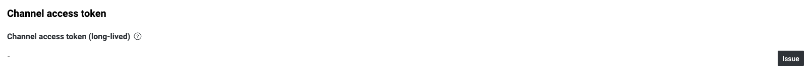


----

## 在Heroku 設定參數

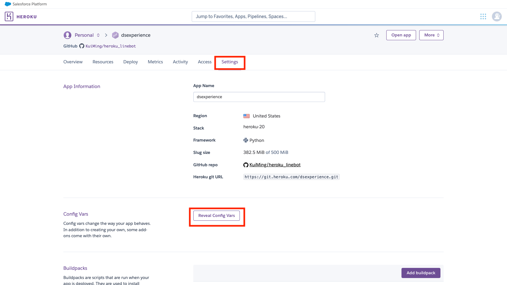

----

## 在Heroku 設定參數

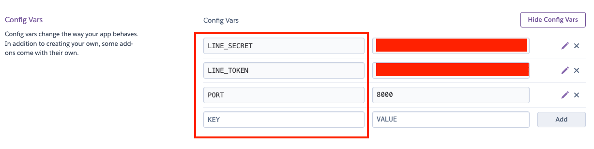

----


**Choose "webhook" and Deploy**


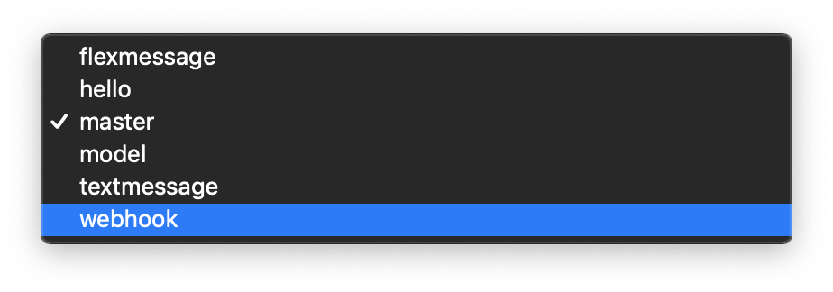


----


### Webhook setting


- 進入 Messaging API channel
- 點選 <font color='#00BD3C'>Messaging API</font>
- 找到Webhook URL
  - 點擊Edit
  - 填上 Azure Web APP 的 URL 加上 <font color='#00BD3C'>/callback</font>
    - example: https://<YOUR WEB APP NAME>.azurewebsites.net/callback
  - 點擊Verify
- 開啟 <font color='#00BD3C'>Use Webhook</font>

----

### Webhook setting

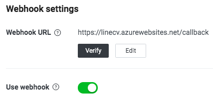


----


### Flask + Line Chatbot


```python
from flask import Flask, request, abort
from linebot import LineBotApi, WebhookHandler
from linebot.exceptions import InvalidSignatureError
app = Flask(__name__)

LINE_SECRET = "YOUR line secret"]
LINE_TOKEN = "YOU line_token"
LINE_BOT = LineBotApi(LINE_TOKEN)
HANDLER = WebhookHandler(LINE_SECRET)

@app.route("/callback", methods=["POST"])
def callback():
    # X-Line-Signature: 數位簽章
    signature = request.headers["X-Line-Signature"]
    print(signature)
    body = request.get_data(as_text=True)
    print(body)
    try:
        HANDLER.handle(body, signature)
    except InvalidSignatureError:
        print("Check the channel secret/access token.")
        abort(400)
    return "OK"

```

----

**Choose "textmessage" and Deploy**


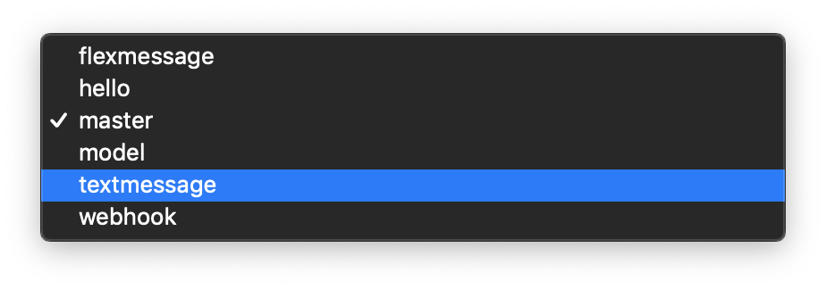


----

## 試著跟 chatbot 對話


----

## Text Message


```python

from linebot.models import (
    MessageEvent,
    TextMessage,
    TextSendMessage,
)
@HANDLER.add(MessageEvent, message=TextMessage)
def handle_message(event: MessageEvent) -> None:
    """
    Reply text message
    """
    text = event.message.text.replace(" ", "").lower()
    if text == "github":
        output = "https://github.com/KuiMing/heroku_linebot"
    else:
        output = text
    message = TextSendMessage(text=output)
    LINE_BOT.reply_message(event.reply_token, message)
```

----


**Choose "flexmessage" and Deploy**

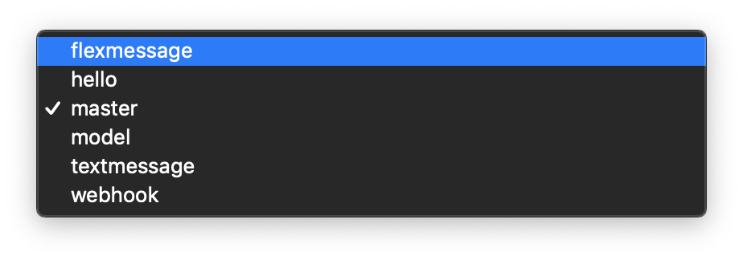

----

## 輸入 currency 


----

## Flex Message

- 客製化的互動對話介面
- 透過 JSON 格式編輯版面
- 適用於各種載體

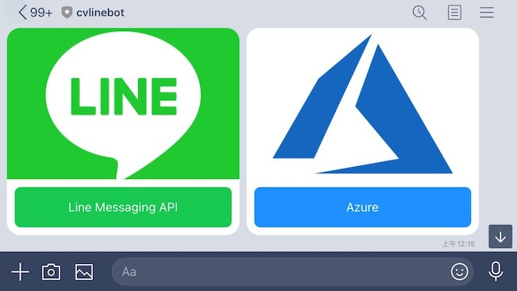

----

## Flex Message elements

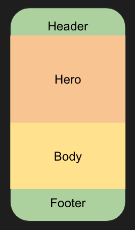

----

## Flex Message Simulator

- 進入 https://developers.line.biz/flex-simulator/
- 使用 LINE 帳號登入
- 開始編輯Flex Message:
  - 點選 Showcase，依照需求選擇範本
  - 點選New，選擇 bubble 或 carousel
- 依需求編輯或增減 components
- 編輯完成後，可點選`View as JSON`，複製內容，存成 JSON 檔

----

### Components 零件

- Box: 用來乘載其他零件
- Button: 可以用來觸發某些動作的按鈕，例如：前往某一網站或產生訊息
- Image: 影像連結
- Icon: icon連結
- Text: 單一字串，可控制字體字型
- Span: 可將不同字體字型的字串放在一行內
- Separator: 分隔線
- Filler: 產生空間，通常用來排版

----

## Flex Message Simulator

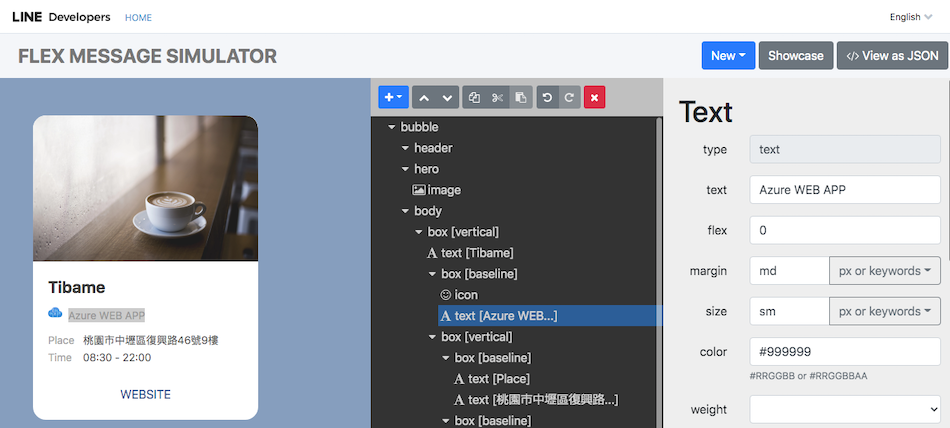


----

## Flex Message Simulator


----

## FlexMessage

```python
from linebot.models import FlexSendMessage
import investpy

def bubble_currency() -> dict:
    """
    create currency bubble
    """
    with open("bubble.json", "r") as f_h:
        bubble = json.load(f_h)
    f_h.close()
    bubble = bubble['contents'][0]
    recent = investpy.get_currency_cross_recent_data("USD/TWD")
    bubble['body']['contents'][1]['contents'][0]['contents'][0]['text'] = \
        f"{round(recent.Close.values[-1], 2)} TWD = 1 USD"
    return bubble


@HANDLER.add(MessageEvent, message=TextMessage)
def handle_message(event: MessageEvent) -> None:
    """
    Reply text message
    """
    text = event.message.text.replace(" ", "").lower()
    if text == "currency":
        bubble = bubble_currency()
        message = FlexSendMessage(alt_text="Report", contents=bubble)
        LINE_BOT.reply_message(event.reply_token, message)
    if text == "github":
        output = "https://github.com/KuiMing/heroku_linebot"
    else:
        output = text
    message = TextSendMessage(text=output)
    LINE_BOT.reply_message(event.reply_token, message)
```


----

### 圖文選單

- 有興趣的話，可以自己嘗試
- 進入 https://manager.line.biz/
- 選擇 **圖文選單**，進行設定

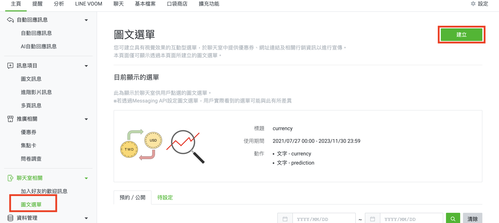

---

# 部署模型

----


**Choose "model" and Deploy**


----


## 預測結果


- https://你的app名稱.herokuapp.com/predict
- 應該會出現美金台幣的匯率預測值


----

## View Logs

- 在做任何動作之前，可以先打開 View logs，方便除錯
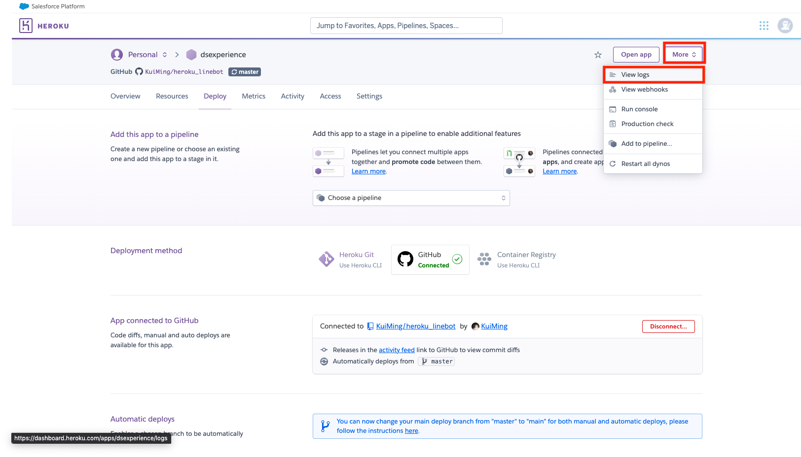


----

## View Logs

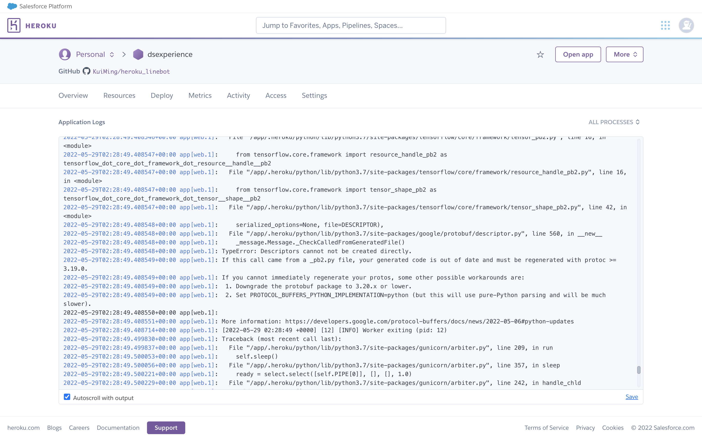

----

## Prediction

```python
from keras.models import load_model
import 

@APP.route("/predict")
def predict() -> str:
    """
    Prediction
    """
    today = datetime.now()
    model = load_model("model.h5")
    with open("scaler.pickle", "rb") as f_h:
        scaler = pickle.load(f_h)
    f_h.close()
    data = investpy.get_currency_cross_historical_data(
        "USD/TWD",
        from_date=(today - timedelta(weeks=105)).strftime("%d/%m/%Y"),
        to_date=today.strftime("%d/%m/%Y"),
    )
    data.reset_index(inplace=True)
    data = data.tail(240).Close.values.reshape(-1, 1)
    data = scaler.transform(data)
    data = data.reshape((1, 240, 1))
    # make prediction
    ans = model.predict(data)
    ans = scaler.inverse_transform(ans)
    return str(round(ans[0][0], 2))
```

---


# 整合所有功能

----

**Choose "master" and Deploy**

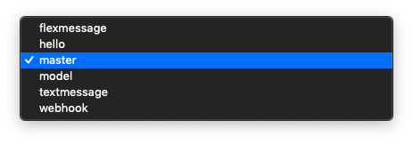

----


----

```python [1-15 | 17-21 | 24-27 | 30-52 | 55-72 | 73-86 | 89-103 | 103-123]
import os
import json
from datetime import datetime, timedelta
import pickle
from flask import Flask, request, abort
from linebot import LineBotApi, WebhookHandler
from linebot.exceptions import InvalidSignatureError
from linebot.models import (
    MessageEvent,
    TextMessage,
    TextSendMessage,
    FlexSendMessage,
)
from keras.models import load_model
import investpy

APP = Flask(__name__)
LINE_SECRET = os.getenv('LINE_SECRET')
LINE_TOKEN = os.getenv('LINE_TOKEN')
LINE_BOT = LineBotApi(LINE_TOKEN)
HANDLER = WebhookHandler(LINE_SECRET)


@APP.route("/")
def hello() -> str:
    "hello world"
    return "Hello World!!!!!"


@APP.route("/predict")
def predict() -> str:
    """
    Prediction
    """
    today = datetime.now()
    model = load_model("model.h5")
    with open("scaler.pickle", "rb") as f_h:
        scaler = pickle.load(f_h)
    f_h.close()
    data = investpy.get_currency_cross_historical_data(
        "USD/TWD",
        from_date=(today - timedelta(weeks=105)).strftime("%d/%m/%Y"),
        to_date=today.strftime("%d/%m/%Y"),
    )
    data.reset_index(inplace=True)
    data = data.tail(240).Close.values.reshape(-1, 1)
    data = scaler.transform(data)
    data = data.reshape((1, 240, 1))
    # make prediction
    ans = model.predict(data)
    ans = scaler.inverse_transform(ans)
    return str(round(ans[0][0], 2))


@APP.route("/callback", methods=["POST"])
def callback() -> str:
    """
    LINE bot webhook callback
    """
    # get X-Line-Signature header value
    signature = request.headers["X-Line-Signature"]
    print(signature)
    body = request.get_data(as_text=True)
    print(body)
    try:
        HANDLER.handle(body, signature)
    except InvalidSignatureError:
        print(
            "Invalid signature. Please check your channel access token/channel secret."
        )
        abort(400)
    return "OK"


def bubble_currency() -> dict:
    """
    create currency bubble
    """
    with open("bubble.json", "r") as f_h:
        bubble = json.load(f_h)
    f_h.close()
    bubble = bubble['contents'][0]
    recent = investpy.get_currency_cross_recent_data("USD/TWD")
    bubble['body']['contents'][1]['contents'][0]['contents'][0]['text'] = \
        f"{round(recent.Close.values[-1], 2)} TWD = 1 USD"
    return bubble


def bubble_predcition() -> dict:
    """
    create prediction bubble
    """
    with open("bubble.json", "r") as f_h:
        bubble = json.load(f_h)
    f_h.close()
    bubble_pred = bubble['contents'][1]
    predicted_currency = predict()
    bubble_pred['body']['contents'][1]['contents'][0]['contents'][0]['text'] = \
        f"{predicted_currency} TWD = 1 USD"
    bubble_curr = bubble_currency()
    bubble['contents'][0] = bubble_curr
    bubble['contents'][1] = bubble_pred
    return bubble


@HANDLER.add(MessageEvent, message=TextMessage)
def handle_message(event: MessageEvent) -> None:
    """
    Reply text message
    """
    currency_option = dict(currency=bubble_currency,
                           prediction=bubble_predcition)
    text = event.message.text.replace(" ", "").lower()
    if text in currency_option.keys():
        bubble = currency_option[text]()
        message = FlexSendMessage(alt_text="Report", contents=bubble)
        LINE_BOT.reply_message(event.reply_token, message)
    if text == "github":
        output = "https://github.com/KuiMing/heroku_linebot"
    else:
        output = text
    message = TextSendMessage(text=output)
    LINE_BOT.reply_message(event.reply_token, message)


if __name__ == "__main__":
    APP.run(debug=True)
```


---

# LSTM


----

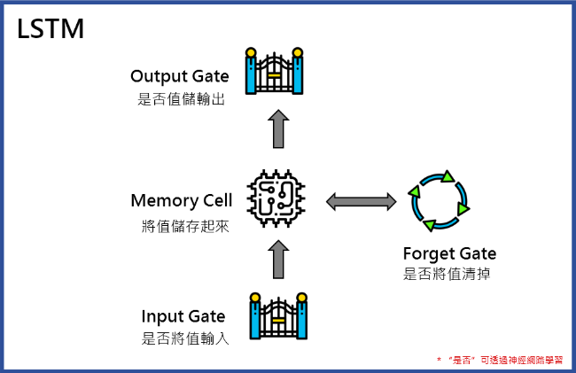


<font size=2 color="#33C7FF" style="position: absolute; top: 650px; left: 50px">https://ithelp.ithome.com.tw/articles/10223055</font>


----


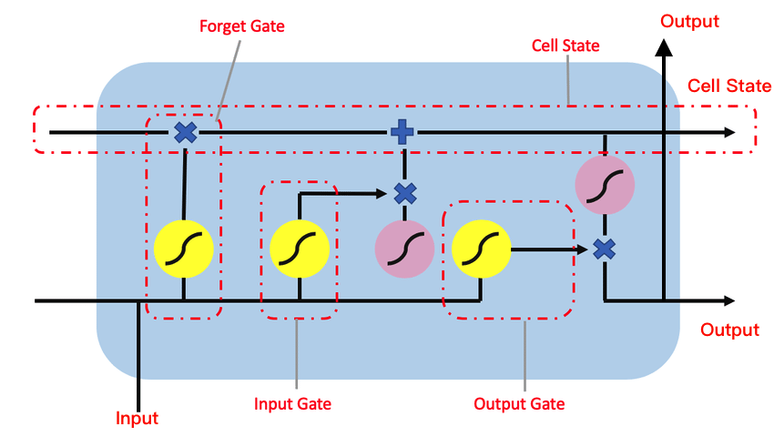


<font size=2 color="#33C7FF" style="position: absolute; top: 650px; left: 50px">https://www.researchgate.net/figure/The-LSTM-unit-contain-a-forget-gate-output-gate-and-input-gate-The-yellow-circle_fig2_338717757</font>

----

## Just like Neuron

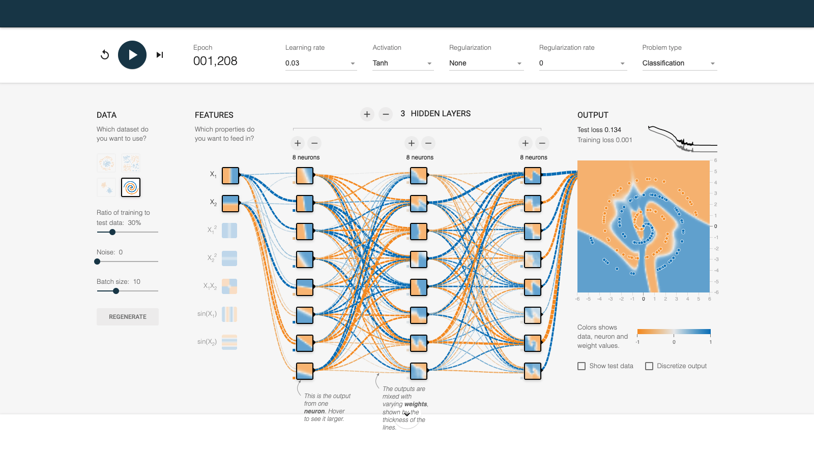


<font size=2 color="#33C7FF" style="position: absolute; top: 650px; left: 50px">https://playground.tensorflow.org/</font>


----

## 取得教學範例

- LSTM
  - https://reurl.cc/NAxmKx


----

## packages

```
!pip install investpy
```


```python
import investpy
from datetime import datetime, timedelta
from sklearn.preprocessing import MinMaxScaler
import numpy as np
import pickle
from keras.preprocessing.sequence import TimeseriesGenerator
from keras.models import Sequential, load_model
from keras.layers import Dense, LSTM, Dropout
```
----

## Download Data

https://www.investing.com/
```python
usd_twd = investpy.get_currency_cross_historical_data(
            "USD/TWD",
            from_date="01/01/1900",
            to_date=datetime.now().strftime("%d/%m/%Y"),
        )
usd_twd.reset_index(inplace=True)

```

----

## Normalization

$$\frac{data - min}{max - min}$$

```python
close = usd_twd.Close.values.reshape(-1, 1)
scaler = MinMaxScaler(feature_range=(0, 1))
scaler.fit(close)
with open("scaler.pickle", "wb") as f_h:
    pickle.dump(scaler, f_h)
f_h.close()
```

----

## generate dataset

- 依照時間順序產生 training data and validation data

```python [1-18 | 20-24]
def data_generator(data, data_len=240):
    generator = TimeseriesGenerator(
        data=data,
        targets=range(data.shape[0]),
        length=data_len,
        batch_size=1,
        stride=1)
    x_all = []
    for i in generator:
        x_all.append(i[0][0])
    x_all = np.array(x_all)
    y_all = data[range(data_len, len(x_all) + data_len)]
    rate = 0.4
    x_train = x_all[:int(len(x_all) * (1 - rate))]
    y_train = y_all[:int(y_all.shape[0] * (1 - rate))]
    x_val = x_all[int(len(x_all) * (1 - rate)):]
    y_val = y_all[int(y_all.shape[0] * (1 - rate)):]
    return x_train, y_train, x_val, y_val

data = usd_twd[
    (usd_twd.Date >= "2010-01-01") & \
        (usd_twd.Date < "2021-01-01")]
data = scaler.transform(data.Close.values.reshape(-1, 1))
x_train, y_train, x_val, y_val = data_generator(data)
```

----

## Model

```python
model = Sequential()
model.add(LSTM(16, input_shape=(240, 1)))
model.add(Dropout(0.1))
model.add(Dense(1))
model.compile(loss="mse", optimizer="adam")
model.summary()
```

```
_________________________________________________________________
 Layer (type)                Output Shape              Param #   
=================================================================
 lstm (LSTM)                 (None, 16)                1152      
 dropout (Dropout)           (None, 16)                0         
 dense (Dense)               (None, 1)                 17        
=================================================================
Total params: 1,169
Trainable params: 1,169
Non-trainable params: 0
_________________________________________________________________
```

----

## Dropout


<font size=2 color="#33C7FF" style="position: absolute; top: 625px; left: 50px">https://mohcinemadkour.github.io/posts/2020/04/Deep%20Learning%20Regularization/</font>

----

## Training

```python
model.fit(
        x_train,
        y_train,
        epochs=1000,
        batch_size=240,
        verbose=1,
        validation_data=[x_val, y_val])
model.save("model.h5")
```
----

## Evaluation

```python
data_test = usd_twd[usd_twd.Date > "2021-01-01"]
data_test = scaler.transform(data_test.Close.values.reshape(-1, 1))
x_test, y_test, x_val, y_val = data_generator(data)
model.evaluate(x_test, y_test)
```

---

# MLOps

Machine Learning + Development + Operations

----


<font size=2 color="#33C7FF" style="position: absolute; top: 625px; left: 50px">https://proceedings.neurips.cc/paper/2015/file/86df7dcfd896fcaf2674f757a2463eba-Paper.pdf
</font>

----

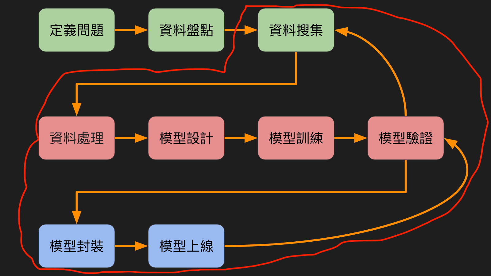

----

## 模型註冊

- 紀錄每個模型的前世今生
  - 訓練參數
  - 訓練資料
  - 模型驗證的結果
  - 是否繼承現成的模型

----

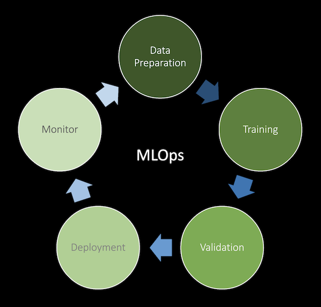