# Data Science

---

<!-- .slide: data-background="media/Ben.png" -->

----

## 學歷

- 醫學放射技術學系 <!-- .element: class="fragment" data-fragment-index="1" -->
- 生物醫學資訊研究所 <!-- .element: class="fragment" data-fragment-index="2" -->

---

## Outline

- 名詞解釋
- 資料分析應用成熟度
- AI solution pipeline​
- 資料思考方法與流程
- 問題盤點
- 資料盤點
- 資料出口

---

## 名詞解釋

- 大數據
- 資料科學
- 人工智慧
- 機器學習

----

## Big Data

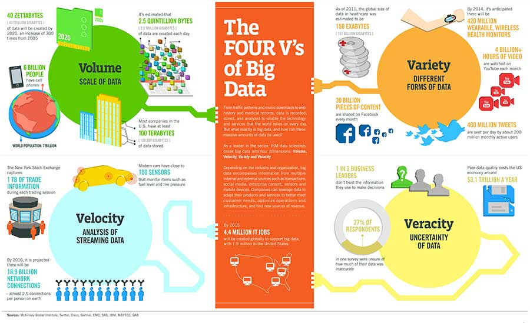

http://article.nadiapub.com/IJAST/vol107/3.pdf

----

大數據 --> 數據為大

----

以人為本，數據為大

----

## Data Science

https://towardsdatascience.com/data-science-interview-guide-4ee9f5dc778

----

<!-- .slide: data-background="media/history.png" -->

----

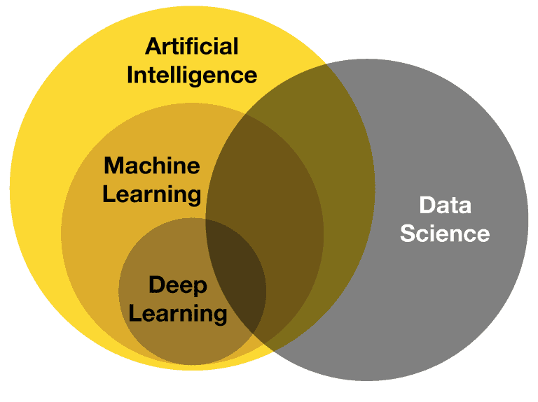

----

## 機器學習

- 監督式學習 (Supervised Learning)
  - 從成對的問題與答案的資料中找到規則，需要明確定義 (歸納/分類/標註) 問題的答案才能使用
  - 讓電腦看各種貓和狗的圖片 (1000張)，再拿一張新的圖片問電腦這是貓還是狗

----

<!-- .slide: data-background="media/supervised.png" -->

監督式學習

----

## 機器學習

- 非監督式學習 (Unsupervised Learning)
  - 從問題 (資料) 中找到規則，標註或歸納工作由機器自行學習
  - 讓電腦看10萬張照片，能自行歸納照片，可以將照片分群組，或是判斷任一張照片跟誰像跟誰不像

----

<!-- .slide: data-background="media/unsupervised.png" -->

非監督式學習

----

## 機器學習

- 半監督式學習（Semi-supervised learning）：
  - 一開始訓練用的資料，只有部份有標準答案，電腦只能透過這些有答案的資料找出特徵並且進行分類，隨後再依學習到的特徵，反覆推敲出所有資料的答案。

----

<!-- .slide: data-background="media/semi-supervised.png" -->

半監督式學習

----

## 機器學習

- 增強式學習 (Reinforcement learning)
  - 從嘗試錯誤中找出成功路徑，電腦與環境互動，透過人為定義哪一步是正確、錯誤，逐步修正
  - AlphaGo 自學圍棋、讓電腦自學瑪莉歐

----

增強式學習

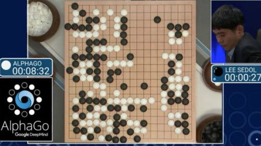

https://www.bbc.com/zhongwen/trad/china/2016/03/160312_alphago_win

----

## 機器學習

- 自監督式學習（Self-supervised learning）：
  - 算是非監督式學習的一種，不同的是，利用此種方式可以將沒有標註的資料，產生標註並且學習。

國民小學 → 國☐小學 → ☐：民

----

## 人工智慧必備條件

* 沒有資料，就沒有人工智慧
* 資料品質不好，就沒有人工智慧
* 你沒有答案的事，就沒有人工智慧
* 資料沒有變異性，就沒有人工智慧
* 資料沒有再現性，就沒有人工智慧
* 同樣的問題，不同工程師訓練的模型，結果可能天差地遠
* 人工智慧導入後，必然改變過往工作或決策流程
* 人工智慧導入後，需要長期觀察定期翻新
* 人工智慧的導入，必然牽扯到資料治理與數位轉型

----

## 名詞解釋

- 大數據：資料的來源
- 資料科學：擷取資料中的意涵與見解
- 機器學習：人工智慧的一部分，找出資料中的規律，進而預測未知資料
- 人工智慧：從資料中學習，模仿人類思惟與行動

---

## 資料分析應用成熟度

----

### Level 1
- 起點
  - 已開始蒐集資料
  - 資料之間未串連
- 里程碑
  - *獨立的資訊看板*
  - 營運狀況*監控*
- 案例
  - 生產品質監控
  - 設備稼動率監控

----

### Level 2

- 起點
  - 已開始蒐集資料
  - *加總資料*已串連
- 里程碑
  - *跨域資料查詢*
  - **整合式資訊看板**
  - *統計推論*
- 案例
  - 生產履歷分析
  - 製程異常檢測

----

## knowledge discovery in databases 

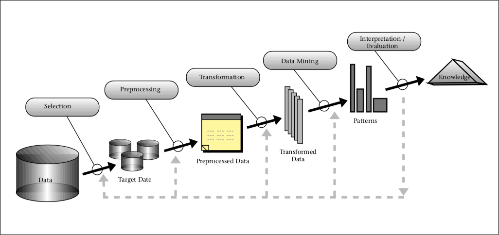

https://doi.org/10.1609/aimag.v17i3.1230

----

### Level 3

* 起點
  * 已開始蒐集資料
  * *原始資料*已串連
  * 足夠*運算資源* 
* 里程碑
  * *機器學習模型*
  * *預測*
* 案例
  * 製程操作模擬
  * 節能操作建議

----

### Level 4

* 起點
  * 已開始蒐集資料
  * 原始資料已串連
  * *強大運算資源*
* 里程碑
  * *深度學習模型*
  * *辨識（影像、聲音、文字等）*
  * *模擬*與*最佳化* 
* 案例
  * 即時修模
  * 增強學習

----

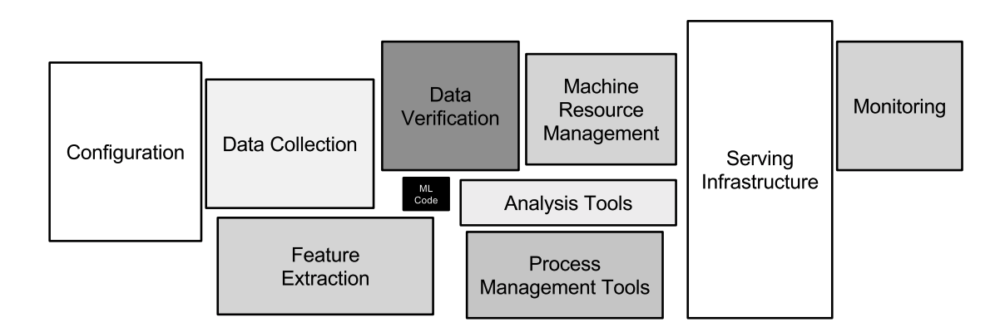

https://proceedings.neurips.cc/paper/2015/file/86df7dcfd896fcaf2674f757a2463eba-Paper.pdf

----

## 80% 的工作

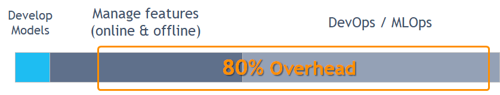

https://towardsdatascience.com/ml-ops-challenges-solutions-and-future-trends-d2e59b74dc6b

---

## AI solution pipeline​

----

## AI solution pipeline​

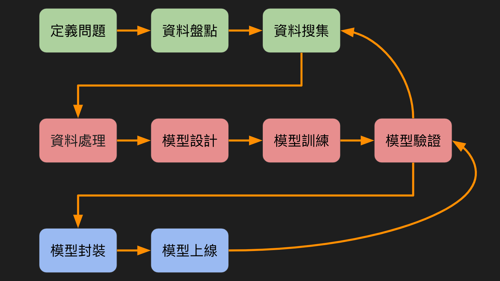

----

## 開發階段

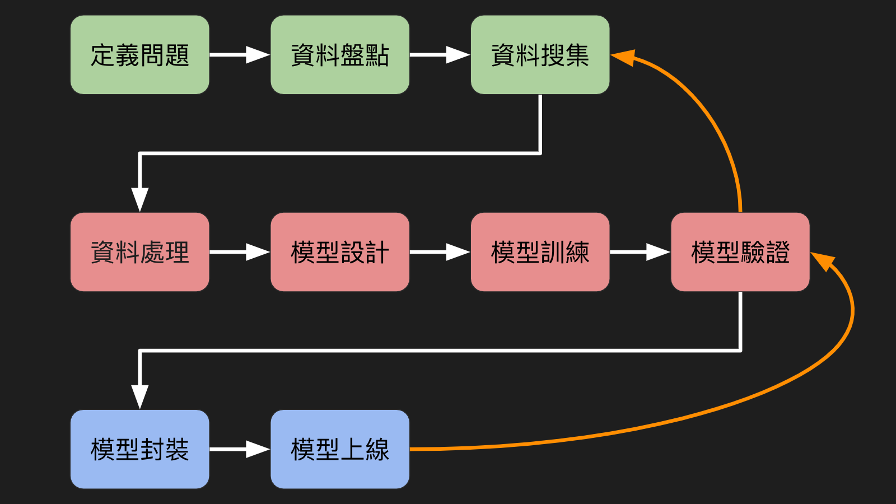

----

## 維護階段

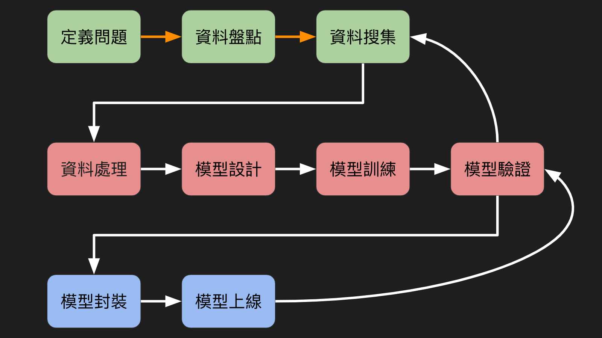

----

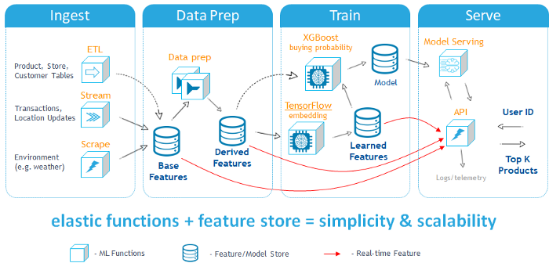

https://towardsdatascience.com/ml-ops-challenges-solutions-and-future-trends-d2e59b74dc6b

---

## 資料思考方法與流程

觀察現狀-問對問題-取得資料

----

## 什麼是一個好的專案？

找出問題，提出解法

----

## 如何找出問題？

- 新冠肺炎疫情爆發後，政府面臨的社會問題
  - 民眾搶民生物資（口罩、體溫計、衛生紙、食物）
  - 民心惶惶，股匯市有恐慌性下跌的可能
  - 活動喊卡、餐旅退訂潮、重挫觀光
  - 學校延後開學，爸媽頭大
- 先列出各種問題，選出一個解決

----

## 如何設計出解決方案？

- 2020年2月口罩地圖專案

https://mohw-mask.pu.idv.tw/

----

## 設計思考

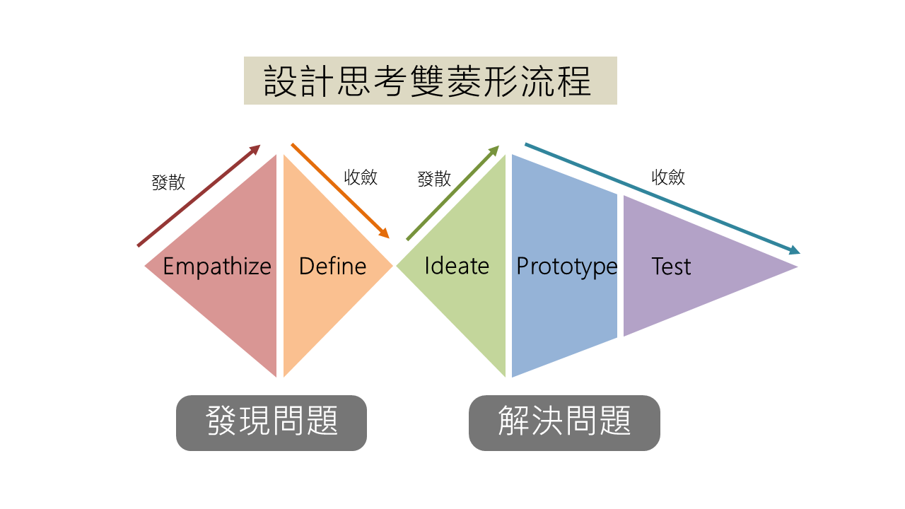

https://bigdata.nccu.edu.tw/t/topic/533

---

## 問題盤點

站在特定角色上，以該角色的立場，思考問題點。

----

### 舉例- 急診室壅塞

急診室可能會有哪些人？

----

傷患、警察、消防員

https://news.tvbs.com.tw/local/541215

----

醫生、家屬

https://news.tvbs.com.tw/local/541215

----

護理師、其他醫療人員

https://news.tvbs.com.tw/local/541215

----

保全

https://news.tvbs.com.tw/local/541215

----

護佐
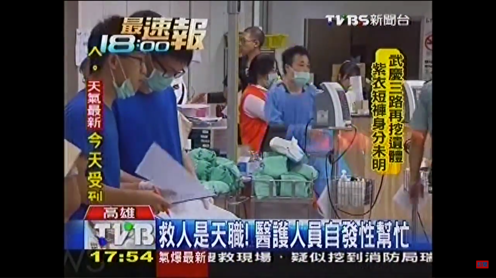

https://news.tvbs.com.tw/local/541215

----

其他協助人員

https://news.tvbs.com.tw/local/541215

----

### 病患與家屬的痛點

- 無助等待...
- 害怕交叉感染...
- 環境壅擠雜亂...
- 小孩哭鬧....
- 擔心小孩的情況...
- 醫護人員忙到忘記我...

----

### 急診室人員遇到的痛點

- 人手不足
- 急診暴力
- 高壓
- 休息時間不夠
- 擔心醫療糾紛
- 大量傷患突然出現

----

## 定義問題

問題盤點完之後，選擇可以快速落地的題目

---

## 資料盤點

----

<!-- .slide: data-background="media/DV_1.png" -->

From 智庫驅動

----

<!-- .slide: data-background="media/DV_2.png" -->

From 智庫驅動

----

<!-- .slide: data-background="media/DV_3.png" -->

From 智庫驅動

----

<!-- .slide: data-background="media/DV_4.png" -->

From 智庫驅動

----

<!-- .slide: data-background="media/DV_5.png" -->

From 智庫驅動

----

<!-- .slide: data-background="media/DV_6.png" -->

From 智庫驅動

----

<!-- .slide: data-background="media/DV_7.png" -->

---

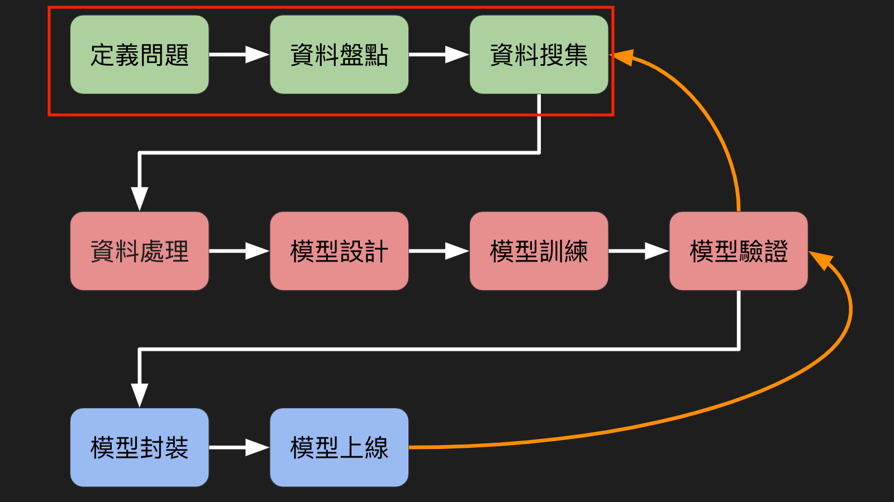

---

## 資料出口

----

### 資料視覺化

<!-- .slide: data-background-color="#ffffff" data-background-iframe="https://kuiming.github.io/economic_index/economic_index.html" -->

----

### Chatbot

---

# Thank you!

