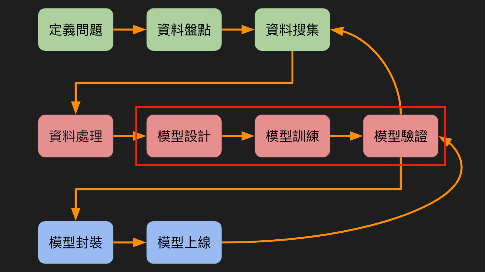
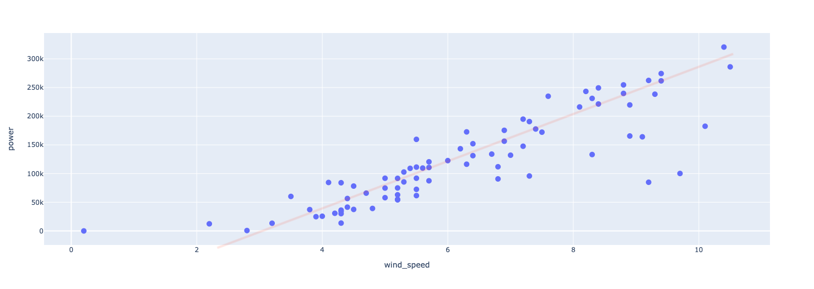
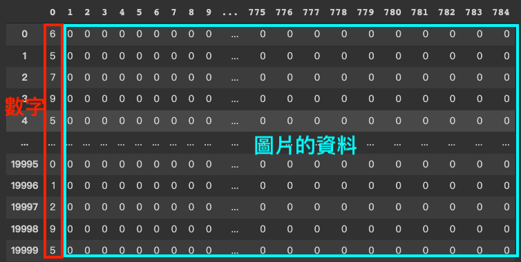
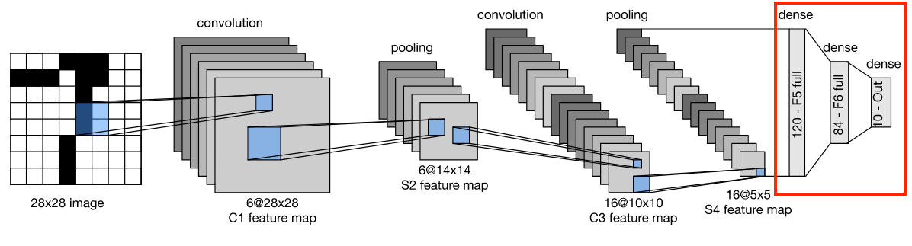
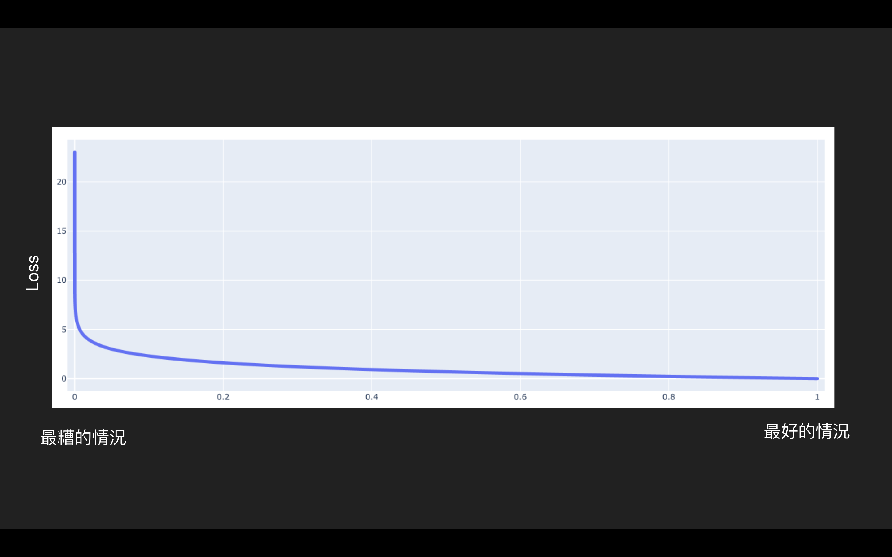
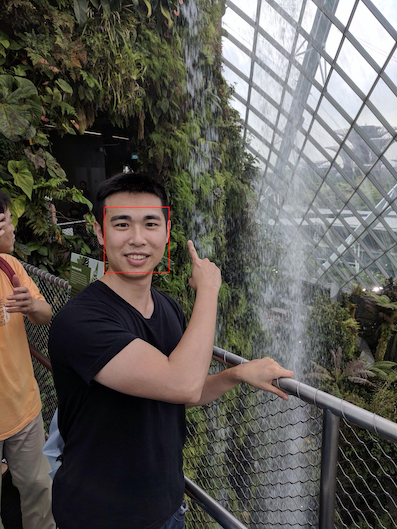

# Machine Learning


#### 講者：陳奎銘 `Benjamin Chen`

---



----


## Machine Learning

- 非監督式學習
  - DBSCAN
- 監督式學習
  - K-Nearest Neighbors
  - Linear Regression
- 深度學習
  - LeNet
  - Face Recognition


----


## 取得教學範例

- machine learning
  - https://reurl.cc/DyOQ2d
- LeNet
  - https://reurl.cc/k1ojeb
- face recognition
  - https://reurl.cc/d2aj36


----

## 今日檔案

- 請先下載這些檔案，並上傳到Colab
  - 連結：https://reurl.cc/x9Ny4b
      - `tutorial_latlon.csv` 
      - `windy_power.csv`


---

# DBSCAN

Density-based spatial clustering of applications with noise

### 分析手機使用者的GPS訊號

----

## POI

- Point Of Interesting
- GPS- Global Positioning System
- Geolocation: 
  - 緯度 latitude
  - 經度 longitude
- 資料都是從智慧型手機取得

----

<!-- .slide: data-background-color="#ffffff" data-background-iframe="media/map.html" -->

----


<!-- .slide: data-background="media/DBSCAN_principle.png" -->


----

## DBSCAN


----

## DBSCAN


<font size=2 color="#33C7FF" style="position: absolute; top: 650px; left: 50px">https://ml-explained.com/blog/dbscan-explained</font>


----


## 觀察資料

```python
import pandas as pd
import numpy as np
from sklearn.cluster import DBSCAN
import folium
data = pd.read_csv("tutorial_latlon.csv")

loc_center = [data['lat'].mean(), data['lon'].mean()]
map_base = folium.Map(location = loc_center, tiles='Openstreetmap', 
                  zoom_start = 18, control_scale=True)
for index, loc in data.iterrows():
    folium.CircleMarker([loc['lat'], loc['lon']], 
                        radius=1, weight=5, color="black",
                        popup=f"{loc['lat']},{loc['lon']}").add_to(map_base)
map_base
```

----


<!-- .slide: data-background-color="#ffffff" data-background-iframe="media/map.html" -->


----


## 畫地圖 function

```python
def draw_map(data):
  loc_center = [data['lat'].mean(), data['lon'].mean()]
  map_base = folium.Map(location = loc_center, tiles='Openstreetmap', 
                    zoom_start = 18, control_scale=True)
  for index, loc in data.iterrows():
      folium.CircleMarker([loc['lat'], loc['lon']], 
                          radius=1, weight=5, color=loc['color'], 
                          popup=f"{loc['lat']},{loc['lon']}").add_to(map_base)
  return map_base
```

----


## 執行 DBSCAN

```python
db = DBSCAN(eps=3e-5, min_samples=10).fit(data.values)
data["label"] = db.labels_
data.label.unique()
```


```
array([ 0,  1,  2, -1])
# 0, 1, 2 代表不同分群，-1 代表無法分群
```
----


## 畫圖觀察分群

```python
color = ["red", "green", "blue", "black"]
f = lambda x: color[int(x)] # 匿名函數
data["color"] = data.label.apply(f)
map_dbscan = draw_map(data)
map_dbscan
```

----

<!-- .slide: data-background-color="#ffffff" data-background-iframe="media/dbscan_map.html" -->

----

## 調整參數會如何？

改變 `eps`
```python
data = pd.read_csv("tutorial_latlon.csv")
db = DBSCAN(eps=3e-4, min_samples=10).fit(data.values)
data["label"] = db.labels_
color = ["red", "green", "blue", "black"]
f = lambda x: color[int(x)] # 匿名函數
data["color"] = data.label.apply(f)
map_dbscan = draw_map(data)
map_dbscan
```

----

## 經緯度對應的距離


----


---

# `K-Nearest Neighbors`

### 分析鳶尾花的花瓣與萼片

----

## K-Nearest Neighbors

- 計算待測資料與其他資料點之間的距離
- 選擇與待測資料最近的 K 個資料點
- 投票：算出 K 個資料點中，哪個類別出現最多次，出現最多次的類別作為待測資料的類別


<font size=2 color="#33C7FF" style="position: absolute; top: 650px; left: 50px">https://medium.com/dropout-analytics/beginners-guide-to-knn-with-cuml-ddca099f9e9d</font>


----

## Iris


<font size=2 color="#33C7FF" style="position: absolute; top: 650px; left: 50px">http://mirlab.org/jang/books/dcpr/datasetiris.asp?title=2-2+iris+dataset&language=all</font>


----


## Iris


<font size=2 color="#33C7FF" style="position: absolute; top: 650px; left: 50px">https://www.embedded-robotics.com/iris-dataset-classification/</font>


----

## 讀取資料


```python

from sklearn.neighbors import KNeighborsClassifier
import pandas as pd
import numpy as np
from sklearn import datasets
from sklearn.model_selection import train_test_split
import plotly.express as px

iris = datasets.load_iris()
iris
```

----

## 畫圖觀察


```python
data = pd.DataFrame(iris.data, columns=iris.feature_names)
data["label"] = iris.target
f = lambda x: iris.target_names[x]
data["species"] = data.label.apply(f)
px.scatter(data, "petal length (cm)", "petal width (cm)", color="species")
px.scatter(data, "sepal length (cm)", "sepal width (cm)", color="species")
```

----


## 畫圖觀察


----

## 畫圖觀察


----

## 執行 KNN


```python
# 分成 training 和 testing 資料
x_train, x_test, y_train, y_test = train_test_split(iris.data, iris.target, 
                                                    test_size=0.2, random_state=1)

# 訓練
knn = KNeighborsClassifier(n_neighbors=3,p=2)
knn.fit(x_train, y_train)
# 預測
pred_test = knn.predict(x_test)
pred_train = knn.predict(x_train)
```


----

## 觀察分類結果

觀察正確率
```python
knn.score(x_train, y_train)
```
```
0.95
```
```python
knn.score(x_test, y_test)
```
```
1
```
----

## 觀察分類結果
```python [1-8|9-13|14-17|18-19]
# 整理一下資料
data_knn = pd.DataFrame(
    np.append(x_train, x_test, axis=0), 
    columns=iris.feature_names)
data_knn['label'] = np.append(y_train, y_test, axis=0)
data_knn['training'] = ["train"] * len(x_train) + ["test"] * len(x_test)
data_knn["prediction"] = np.append(pred_train, pred_test, axis=0)

# 把分類錯誤的結果標示為 Wrong
f = lambda x: iris.target_names[x]
data_knn["answer"] = data_knn.label.apply(f)
data_knn.loc[data_knn["prediction"] - data_knn["label"] != 0, "answer"] = "Wrong"

# 把真實類別與預測結果另外處理
data_knn["species"] = data_knn.label.apply(f)
data_knn["prediction_species"] = data_knn.prediction.apply(f)

px.scatter(data_knn, "petal length (cm)", "petal width (cm)", 
           color="answer", hover_data=["species", "prediction_species"])

```

----

## 觀察分類結果


----

## 試著調整 K

```python [1-8 | 10-15 | 17]
# K 從 1 試到 99
accuracy_train = []
accuracy_test = []
for k in range(1, 100):
  knn = KNeighborsClassifier(n_neighbors=k)
  knn.fit(x_train, y_train)
  accuracy_train.append(knn.score(x_train, y_train))
  accuracy_test.append(knn.score(x_test, y_test))

# 整理結果
accuracy = pd.DataFrame(dict(
    k=list(range(1, 100)) * 2,
    accuracy=np.append(accuracy_train, accuracy_test),
    train=["train"] * 99 + ["test"] * 99
    ))

px.line(accuracy, x="k", y="accuracy", color="train", markers=True)
```

----

## 試著調整 K


---

# `Linear Regression`

### 分析風力發電機發電量與風速的關係

----

	
<!-- .slide: data-auto-animate -->

## 多少風力產生多少電力


----
	
<!-- .slide: data-auto-animate -->

## 多少風力產生多少電力




----

<!-- .slide: data-auto-animate -->


## 多少風力產生多少電力


- linear regression
- $y = b + a \times x$

----

<!-- .slide: data-auto-animate -->

## 多少風力產生多少電力

- linear regression
- $y = b + a \times x$
  - y: 電力, x: 風速
  - 求出 a 和 b- 斜率和截距


----

## 評估模型

- Loss function


$$
Loss(a, b) = \sum _{i=1} ^n (Truth_i - y_i)^2 = 
$$

$$
\sum _{i=1} ^n (Truth_i - b + a \times x_i)^2
$$

$$
a^*, b^* = arg\ min\ Loss(a, b)
$$

----


## 評估模型


- 找到讓誤差最小的參數
  - 最小平方法
  - <font color="red">Gradient Descent</font>

----

## `Gradient Descent`

梯度下降法

----

Gradient Descent

<!-- .slide: data-background="media/gradient_1.png" -->

----


<!-- .slide: data-background="media/gradient_2.png" -->

----

<!-- .slide: data-background="media/gradient_3.png" -->


----

## `Backpropagation`

- 反向傳播
- 根據 Loss 的梯度，反推參數（a, b）
- 讓 Loss 盡量變小

----

## 動手練習

```python
import pandas as pd
from sklearn.model_selection import train_test_split
from scipy.stats import linregress
import plotly.express as px
data = pd.read_csv("windy_power.csv")

fig = px.scatter(data, "wind_speed", "power")
fig.update_traces(mode='markers', marker_size=10) 

```


----


## 動手練習
```python

x_train, x_test, y_train, y_test = train_test_split(
    data.wind_speed.values, data.power.values, test_size=0.2, random_state=0)
lr = linregress(x_train, y_train)

print(f"y = {lr.intercept} + {lr.slope} * x")
print(f"R squre: {lr.rvalue ** 2}")
```

```
y = -88525.52938319303 + 34285.52615057922 * x
R squre: 0.7875220416551721 
# 判定係數：表示產生電力的多寡有約78%受到風速快慢的直線關係影響
```

----


## 動手練習

```python
def lr_plot(x, y, prediction):
  df = pd.DataFrame(dict(wind_speed=x, power=y, prediction=prediction))
  fig = px.scatter(df, "wind_speed", "power") 
  fig_p = px.line(df, "wind_speed", "prediction", color_discrete_sequence=['red'], markers=True)
  fig.add_trace(fig_p.data[0])
  fig['data'][0]['showlegend']=True
  fig['data'][1]['showlegend']=True
  fig['data'][0]['name']='power'
  fig['data'][1]['name']='prediction'
  fig.update_traces(line_width=2, marker_size=10) 
  fig.show()

pred_train = lr_prediction(x_train, lr)
lr_plot(x_train, y_train, pred_train)
```


----


## 動手練習
```python
pred_test = lr_prediction(x_test, lr)
lr_plot(x_test, y_test, pred_test)

```


---

# `LeNet`

### 偵測圖片中的數字

----

## LeNet

- 讓電腦識字
- Deep Learning
  - Convolutional Neural Network, CNN
- Mnist dataset: 手寫文字資料集，0~9
  - 20000 筆資料，灰階圖形
  - 28 * 28 * 1 pixels 
  - Colab 內建資料

----

## LeNet


<font size=2 color="#33C7FF" style="position: absolute; top: 650px; left: 50px">https://gfycat.com/gifs/search/artificial+neural+networks</font>

----

## Mnist


<font size=2 color="#33C7FF" style="position: absolute; top: 650px; left: 50px">https://machinelearningmastery.com/how-to-develop-a-convolutional-neural-network-from-scratch-for-mnist-handwritten-digit-classification/</font>


----

## Mnist

```python
import pandas as pd
data = pd.read_csv("sample_data/mnist_train_small.csv", header=None)
data
```




----

## Mnist

```python
from PIL import Image
import numpy as np
from skimage import io
import plotly.express as px
x_train = data.values[:, 1:].reshape(20000, 28, 28)
label = data.values[:, 0]
def show_number(data):
  array = data.astype(np.uint8)
  img = Image.fromarray(array)
  img.save("output.png")
  img = io.imread('output.png')
  fig = px.imshow(img, color_continuous_scale='gray')
  fig.update_xaxes(showticklabels=False)
  fig.update_yaxes(showticklabels=False)
  fig.show()
```

```python
show_number(x_train[305, :,:])
```

----


<!-- .slide: data-background-iframe="media/mnist.html" -->


----

## `LeNet`


<font size=2 color="#33C7FF" style="position: absolute; top: 650px; left: 50px">https://medium.com/mlearning-ai/lenet-and-mnist-handwritten-digit-classification-354f5646c590</font>

----


## `LeNet`

- Deep Learning- CNN
  - Layer
    - Convolution layer 
    - Maxpooling Layer
    - Dense Layer
  - Activation Function
    - tanh
    - softmax
  - Loss function
    - Cross Entropy


----


## `LeNet`


```python

from keras.models import Sequential, load_model
from keras.layers import Dense, LSTM, Dropout, Conv2D, MaxPooling2D, Flatten, Input
from tensorflow.keras.utils import to_categorical

model = Sequential()
model.add(Conv2D(filters=6, kernel_size=(5, 5), activation="tanh", input_shape=(28, 28, 1)))
model.add(MaxPooling2D(pool_size=(2, 2)))
model.add(Conv2D(filters=16, kernel_size=(5, 5), activation="tanh"))
model.add(MaxPooling2D(pool_size=(2, 2)))
model.add(Flatten())
model.add(Dense(120, activation="tanh"))
model.add(Dense(84, activation="tanh"))
model.add(Dense(10, activation="softmax"))
model.compile(
        optimizer="adam", loss="categorical_crossentropy", metrics=["accuracy"]
    )
x_train = x_train / 255 # Normalize
y_train = to_categorical(label) # One-hot encoding

model.fit(
        x_train,
        y_train,
        epochs=10,
        validation_split=0.2,
        batch_size=10
    )
```


----

## Deep Learning 深度學習

- Based on Artificial Neural Network 類神經網路


<font size=2 color="#33C7FF" style="position: absolute; top: 650px; left: 50px">https://www.researchgate.net/figure/A-diagram-showing-a-neuron-making-a-synaptic-connection-with-another-neuron_fig1_258023902</font>

----

## Deep Learning


<font size=2 color="#33C7FF" style="position: absolute; top: 650px; left: 50px">https://www.quora.com/How-can-I-make-new-connections-between-the-neurons-of-my-brain</font>


----

<!-- .slide: data-background-iframe="https://playground.tensorflow.org/" -->


<font size=2 color="#33C7FF" style="position: absolute; top: 650px; left: 50px">https://playground.tensorflow.org/</font>


----

## Convolutional Neural Network- CNN


- 卷積神經網路
- 圖像辨識
- LeNet
  - Convolution Layer- 卷積層
  - Maxpooling Layer- 最大池化層
  - Dense Layer
    - Full-Connected Layer
    - 全連接層


----

## `Convolution Layer` 卷積層


<font size=2 color="#33C7FF" style="position: absolute; top: 650px; left: 50px">https://medium.com/mlearning-ai/lenet-and-mnist-handwritten-digit-classification-354f5646c590</font>


----

## `Convolution Layer`


<font size=2 color="#33C7FF" style="position: absolute; top: 650px; left: 50px">https://medium.datadriveninvestor.com/convolutional-neural-networks-3b241a5da51e</font>


----

## `Convolution Layer`


<font size=2 color="#33C7FF" style="position: absolute; top: 650px; left: 50px">https://medium.datadriveninvestor.com/convolutional-neural-networks-3b241a5da51e</font>


----

## `Convolution Layer`

```python [6,8]
from keras.models import Sequential, load_model
from keras.layers import Dense, LSTM, Dropout, Conv2D, MaxPooling2D, Flatten, Input
from tensorflow.keras.utils import to_categorical

model = Sequential()
model.add(Conv2D(filters=6, kernel_size=(5, 5), activation="tanh", input_shape=(28, 28, 1)))
model.add(MaxPooling2D(pool_size=(2, 2)))
model.add(Conv2D(filters=16, kernel_size=(5, 5), activation="tanh"))
model.add(MaxPooling2D(pool_size=(2, 2)))
model.add(Flatten())
model.add(Dense(120, activation="tanh"))
model.add(Dense(84, activation="tanh"))
model.add(Dense(10, activation="softmax"))
model.compile(
        optimizer="adam", loss="categorical_crossentropy", metrics=["accuracy"]
    )
x_train = x_train / 255 # Normalize
y_train = to_categorical(label) # One-hot encoding

model.fit(
        x_train,
        y_train,
        epochs=10,
        validation_split=0.2,
        batch_size=10
    )
```


----


## `Maxpooling Layer` 
## 最大池化層


<font size=2 color="#33C7FF" style="position: absolute; top: 650px; left: 50px">https://medium.com/mlearning-ai/lenet-and-mnist-handwritten-digit-classification-354f5646c590</font>


----


## `Maxpooling Layer`


<font size=2 color="#33C7FF" style="position: absolute; top: 650px; left: 50px">https://en.wikipedia.org/wiki/Convolutional_neural_network</font>


----

## `Maxpooling Layer`

```python [7,9 | 10]
from keras.models import Sequential, load_model
from keras.layers import Dense, LSTM, Dropout, Conv2D, MaxPooling2D, Flatten, Input
from tensorflow.keras.utils import to_categorical

model = Sequential()
model.add(Conv2D(filters=6, kernel_size=(5, 5), activation="tanh", input_shape=(28, 28, 1)))
model.add(MaxPooling2D(pool_size=(2, 2)))
model.add(Conv2D(filters=16, kernel_size=(5, 5), activation="tanh"))
model.add(MaxPooling2D(pool_size=(2, 2)))
model.add(Flatten())
model.add(Dense(120, activation="tanh"))
model.add(Dense(84, activation="tanh"))
model.add(Dense(10, activation="softmax"))
model.compile(
        optimizer="adam", loss="categorical_crossentropy", metrics=["accuracy"]
    )
x_train = x_train / 255 # Normalize
y_train = to_categorical(label) # One-hot encoding

model.fit(
        x_train,
        y_train,
        epochs=10,
        validation_split=0.2,
        batch_size=10
    )
```

----


## `Dense Layer` 全連接層




<font size=2 color="#33C7FF" style="position: absolute; top: 650px; left: 50px">https://medium.com/mlearning-ai/lenet-and-mnist-handwritten-digit-classification-354f5646c590</font>


----


<!-- .slide: data-background-color="#ffffff" -->
## `Dense Layer`
Full-Connected Layer


----

## `LeNet`


- 萃取出圖片特徵
- 根據圖片特徵判斷數字

<font size=2 color="#33C7FF" style="position: absolute; top: 650px; left: 50px">https://medium.com/mlearning-ai/lenet-and-mnist-handwritten-digit-classification-354f5646c590</font>


----

## `Dense Layer`


```python [11-13]
from keras.models import Sequential, load_model
from keras.layers import Dense, LSTM, Dropout, Conv2D, MaxPooling2D, Flatten, Input
from tensorflow.keras.utils import to_categorical

model = Sequential()
model.add(Conv2D(filters=6, kernel_size=(5, 5), activation="tanh", input_shape=(28, 28, 1)))
model.add(MaxPooling2D(pool_size=(2, 2)))
model.add(Conv2D(filters=16, kernel_size=(5, 5), activation="tanh"))
model.add(MaxPooling2D(pool_size=(2, 2)))
model.add(Flatten())
model.add(Dense(120, activation="tanh"))
model.add(Dense(84, activation="tanh"))
model.add(Dense(10, activation="softmax"))
model.compile(
        optimizer="adam", loss="categorical_crossentropy", metrics=["accuracy"]
    )
x_train = x_train / 255 # Normalize
y_train = to_categorical(label) # One-hot encoding

model.fit(
        x_train,
        y_train,
        epochs=10,
        validation_split=0.2,
        batch_size=10
    )
```

----

## `Activation Function`

- 非線性
- 電路開關或閥門
- Example
  - tanh
    - hyperbolic tangent
    - 雙曲正切
  - Softmax

----

## `Tanh`

$$
tanh x = \frac{cosh x}{sinh x} = \frac{e^x - e^{-x}}{e^x + e^{-x}}
$$


----


## `Tanh`

```python [6, 8, 11-12]
from keras.models import Sequential, load_model
from keras.layers import Dense, LSTM, Dropout, Conv2D, MaxPooling2D, Flatten, Input
from tensorflow.keras.utils import to_categorical

model = Sequential()
model.add(Conv2D(filters=6, kernel_size=(5, 5), activation="tanh", input_shape=(28, 28, 1)))
model.add(MaxPooling2D(pool_size=(2, 2)))
model.add(Conv2D(filters=16, kernel_size=(5, 5), activation="tanh"))
model.add(MaxPooling2D(pool_size=(2, 2)))
model.add(Flatten())
model.add(Dense(120, activation="tanh"))
model.add(Dense(84, activation="tanh"))
model.add(Dense(10, activation="softmax"))
model.compile(
        optimizer="adam", loss="categorical_crossentropy", metrics=["accuracy"]
    )
x_train = x_train / 255 # Normalize
y_train = to_categorical(label) # One-hot encoding

model.fit(
        x_train,
        y_train,
        epochs=10,
        validation_split=0.2,
        batch_size=10
    )
```

----

## `Softmax`

$$
\frac{e^{x_i}}{\sum _{i=1} ^{n} (e^{x_i})}
$$

- n 為分類數量
- 輸出為 0 ~ 1 之間
- 總和為 1
- 例如：假設有 A、B、C 三類，某一模型的輸出結果可能為 [0.1, 0.2, 0.7]，分別代表預測為此三類的機率，選擇機率高的作為答案，故將會預測為 C。

----


## `Softmax`

```python [13]
from keras.models import Sequential, load_model
from keras.layers import Dense, LSTM, Dropout, Conv2D, MaxPooling2D, Flatten, Input
from tensorflow.keras.utils import to_categorical

model = Sequential()
model.add(Conv2D(filters=6, kernel_size=(5, 5), activation="tanh", input_shape=(28, 28, 1)))
model.add(MaxPooling2D(pool_size=(2, 2)))
model.add(Conv2D(filters=16, kernel_size=(5, 5), activation="tanh"))
model.add(MaxPooling2D(pool_size=(2, 2)))
model.add(Flatten())
model.add(Dense(120, activation="tanh"))
model.add(Dense(84, activation="tanh"))
model.add(Dense(10, activation="softmax"))
model.compile(
        optimizer="adam", loss="categorical_crossentropy", metrics=["accuracy"]
    )
x_train = x_train / 255 # Normalize
y_train = to_categorical(label) # One-hot encoding

model.fit(
        x_train,
        y_train,
        epochs=10,
        validation_split=0.2,
        batch_size=10
    )
```


----

## `One-Hot Encoding`

- 以 0 和 1 表示，相對應的種類為 1，其他為 0
- 有幾個種類，就會有幾個數字
- 形成由 0 和 1 組成的數列
- 以上述數列作為標準答案，與預測結果相比，計算出 Loss


----

## `One-Hot Encoding`


----

## `Cross Entropy` 交叉熵

$$
\sum _{i=1} ^{n} - Truth_i \times log(Prediction_i)
$$

- Loss Function
- 觀察預測結果的機率分佈與真實情況的機率分佈之間的差異


----


## `Cross Entropy`- 極佳的情況


Loss = 
total cross entropy = 
$$
(- 1 \times log(0.99999)) +  (- 0 \times log(0.00001)) +
$$
$$
(- 0 \times log(0.00001)) + (- 1 \times log(0.99999)) = 
$$
$$
4.34 \times 10^{-6} \times 2 = 8.68 \times 10^{-6}
$$


----


## `Cross Entropy`- 極糟的情況


Loss = 
total cross entropy = 

-log(0.00001) + (-log(0.00001)) =

5 + 5  = 10


----

## `Cross Entropy`



----


## `Cross Entropy`


```python [14-16|17|19-26]
from keras.models import Sequential, load_model
from keras.layers import Dense, LSTM, Dropout, Conv2D, MaxPooling2D, Flatten, Input
from tensorflow.keras.utils import to_categorical

model = Sequential()
model.add(Conv2D(filters=6, kernel_size=(5, 5), activation="tanh", input_shape=(28, 28, 1)))
model.add(MaxPooling2D(pool_size=(2, 2)))
model.add(Conv2D(filters=16, kernel_size=(5, 5), activation="tanh"))
model.add(MaxPooling2D(pool_size=(2, 2)))
model.add(Flatten())
model.add(Dense(120, activation="tanh"))
model.add(Dense(84, activation="tanh"))
model.add(Dense(10, activation="softmax"))
model.compile(
        optimizer="adam", loss="categorical_crossentropy", metrics=["accuracy"]
    )
y_train = to_categorical(label) # One-hot encoding

x_train = x_train / 255 # Normalize
model.fit(
        x_train,
        y_train,
        epochs=10,
        validation_split=0.2,
        batch_size=10
    )
```
----

## Normalization


- 提升收斂速度
- 提高精準度

<font size=2 color="#33C7FF" style="position: absolute; top: 650px; left: 50px">https://ai-pool.com/a/s/normalization-in-deep-learning</font>


----

## Training

```python
model.fit(
        x_train,
        y_train,
        epochs=10,
        validation_split=0.2,
        batch_size=10
    )
```


----

## Testing

```python
test_data = pd.read_csv("sample_data/mnist_test.csv", header=None)
x_test = test_data.values[:,1:].reshape(-1, 28, 28)
x_test = x_test / 255
y_test = to_categorical(test_data.values[:, 0])
pred = model.predict(x_test[32,:,:].reshape(1,28,28,1))
np.argmax(pred)
```

```
3
```

----

## Testing

```python
show_number(x_test[32,:,:] * 255)
```


----

## Testing

```python
model.evaluate(x_test, y_test)
```
```
313/313 [==============================] - 4s 11ms/step - loss: 0.0637 - accuracy: 0.9800
[0.06365595757961273, 0.9800000190734863]
```

---


# `Face Recognition`

人臉辨識

----


## Face Detection



----

## Face Landmark 
### 臉部特徵點


----

### Face Recognition Flow


----

### Face Recognition Flow

- Server
  - 將需要辨識的人臉編碼，取得特徵向量
  - 將特徵向量存入資料庫
- Client
  - 取得人臉影像
  - 將人臉轉換成特徵向量
  - 與資料庫內的特徵向量比對
    - 歐氏距離

----

## 照片資料夾

- 登入自己的 Google Drive
- 產生一個 `photo` 資料夾
- 放進一些人物照片
- 照片檔名改成該照片中人物的名字


----

## 照片資料夾


<font size=2 color="#33C7FF" style="position: absolute; top: 650px; left: 50px">https://www.pexels.com/zh-tw/search/asian/</font>

----

## 照片限制
- 每張照片都應該只有一張臉，不可以無臉
- 有些照片無法辨識：
  - 太亮的影像，例如嚴重的背光
  - 眼睛被擋住
  - 臉型或髮型改變
  - 臉部外觀因為年齡的變化
  - 極端臉部表情
  - 頭部動作太大

----

## 安裝套件

```
!pip install face_recognition

```
- Use `dlib` library
- deep learning 
- Accuracy: 99.38% on the [Labeled Faces in the Wild](http://vis-www.cs.umass.edu/lfw/) benchmark.

----

## 掛載 google drive

- 先在自己的雲端硬碟新增 `photo` 資料夾
- 請自行上傳自己的照片，放到 `photo` 資料夾
- 執行以下程式
```python
import glob
import pickle
import argparse
import face_recognition
import numpy as np
from google.colab import drive
# 將自己的雲端硬碟掛載上去
drive.mount('/content/gdrive')
files = glob.glob("gdrive/MyDrive/photo/*")
```


----

## 建立 face encoding 資料集

```python
face_encodings = []
face_names = []
for img in files:
  image = face_recognition.load_image_file(img)
  encoding = face_recognition.face_encodings(image)
  face_encodings.append(encoding[0])
  face_names.append(img.replace("gdrive/MyDrive/photo/", "").split(".")[0])
```

----

## 測試新照片


```python
def who_are_you(file, face_names, face_encodings):
  # 讀取照片
  image = face_recognition.load_image_file(file)
  # 一一比對新照片的特徵向量與資料集之間的距離
  face_enco = face_recognition.face_encodings(image)
  distances = face_recognition.face_distance(face_encodings, face_enco[0])
  print("與每個人的距離：")
  for name, d in zip(face_names, distances):
    print(f"{name}: {d:.2f}")
  print("===========")
  if min(distances) < 0.5:
    print("你是")
    # 選擇距離最小的名字，前提是距離要小於 0.5
    print(face_names[np.argmin(distances)])
  else:
    print("我不知道這是誰")
```

----

## 測試新照片

- 請上傳自己的照片到 `colab`
- 可以用別人的照片玩玩看

```python
# 這邊檔名改成自己上傳照片的檔名，不要照抄
who_are_you("face.png", face_names, face_encodings)
```
```
與每個人的距離：
D: 0.66
C: 0.51
B: 0.68
A: 0.80
Ben: 0.38
===========
你是
Ben
```