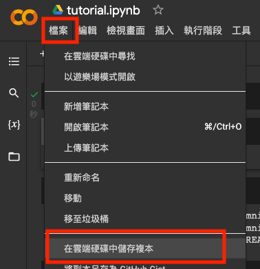
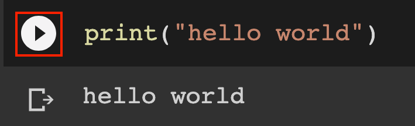
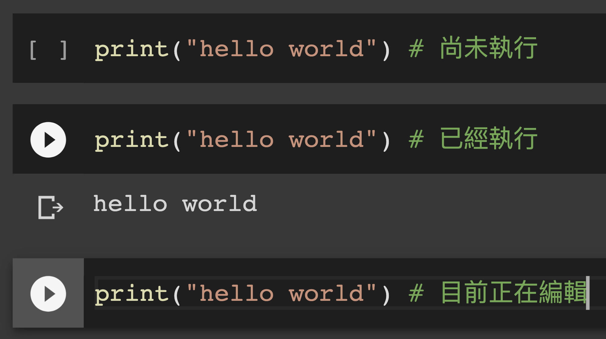
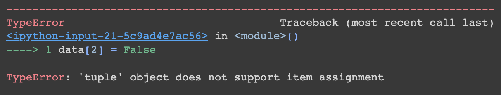
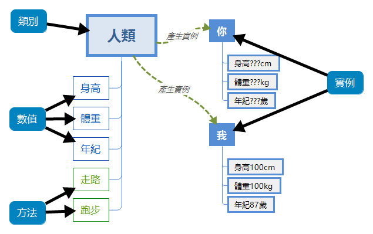
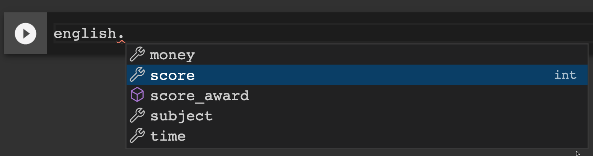
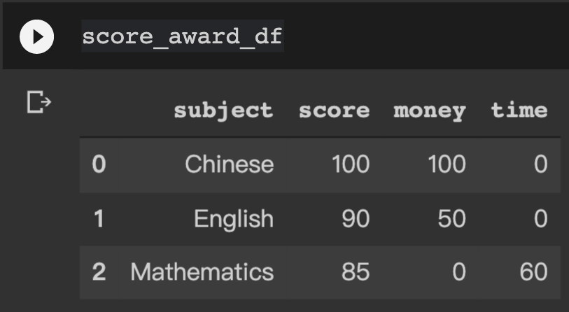

# Python Tutorial

---

## What is Python

- 命名由來：Monty Python's Flying Circus
- 高階程式語言
- 通用型程式語言
- 物件導向

---

## Google Colab

----

## Google Colab
- IDE
  - Integrated Development Environment 
  - 整合開發環境
- python 3.7.12
- 免費CPU虛擬機
- 可用瀏覽器操作
- 可以與他人共用

----

### 取得教學範例

https://colab.research.google.com/drive/1SnqHaVUk-QjUxi5ieexneYFUoJNrNR2g?usp=sharing

- 先儲存副本：檔案-->在雲端硬碟中儲存副本

- 若尚未登入 google 帳號，會被要求登入

----

## 取得教學範例 

- 視個人情況更改檔名


----

## 執行程式碼
- 輸入 `print("hello world")
- CTRL (或者 command) + ENTER 或者 按下 ▶️

- 注意事項：如果長時間不使用，會被斷線，重新連線之後，寫過的程式碼會被保留，但需要重新執行。
  - 連續使用時間限制：12 小時
  - 閒置時間限制：90 分鐘


----

## 儲存格



----

### 快捷鍵

- 按 <font style= "background:gray">`ESC`</font> 鍵：跳出編輯模式
- 按 <font style= "background:gray">`ENTER`</font> 鍵：進入編輯模式
- <font style= "background:gray">`CTRL`</font> or <font style= "background:gray">`command`</font> + <font style= "background:gray">`ENTER`</font>：執行單一儲存格程式
- <font style= "background:gray">`CTRL`</font> or <font style= "background:gray">`command`</font> + <font style= "background:gray">`M`</font> + <font style= "background:gray">`I`</font>：終止執行中的程式
- 在跳出編輯模式的狀態下：
  - 按 <font style= "background:gray">`A`</font> 鍵：向上新增儲存格
  - 按 <font style= "background:gray">`B`</font> 鍵：向下新增儲存格
  - <font style= "background:gray">`CTRL`</font> or <font style= "background:gray">`command`</font> + <font style= "background:gray">`M`</font> + <font style= "background:gray">`D`</font>：刪除儲存格


---

## 變數

- `x`、`y`、`z` 是變數名稱，19、"Ben"、`True` 為值。
```python
x = 19
y = "Ben"
z = True
```
- 必須以英文字母或者底線作為變數的開頭：data、output、_att
- 英文字母大小寫是不同的：input_1 和 Input_1 是不同變數
- 不可使用保留字：有些字詞本身有功能，不可以當作變數，例如if, and, else, or...等等。

----

## 資料型態

- 數值：`int` 和 `float`
- 字串：`str`
- Boolean：`bool`

----

## 數值運算

```python
num = 12 + 3
print(f"12 + 3 = {num}")
num = 43 - 32
print(f"43 - 32 = {num}")
num = 3 * 8
print(f"3 * 8 = {num}")
num = 3 ** 8
print(f"3 ** 8 = {num}")
num = 19 / 3
print(f"19 / 3 = {num}")
num = 19 % 3
print(f"19 % 3 = {num}")
num = 19 // 3
print(f"19 // 3 = {num}")
```

----

## 數值運算

```
12 + 3 = 15
43 - 32 = 11
3 * 8 = 24
3 ** 8 = 6561
19 / 3 = 6.333333333333333
19 % 3 = 1
19 // 3 = 6
```

----

## 字串

- 字串：以雙引號或單引號匡著文字
```python
string = "青山"
print(string)
```
```
青山
```
- 字串也可以先乘後加
```python
string ="很重要！" * 3 + "所以說三次"
print(string)
```
```
很重要！很重要！很重要！所以說三次
```
- `python`裡，座號是從 0 開始。
```python
print(string[0])
```
```
很
```

----

## 字串

- 換行可以用 `\n`
```python
string = "希望我講課的時候，\n烏克蘭已經得到和平"
print(string)
```
```
希望我講課的時候，
烏克蘭已經得到和平
```
- 如果文字很多段，可以用 3 + 3 個雙引號包起來
```python
string = """
希望我講課的時候，
烏克蘭已經得到和平
"""
print(string)
```

---

## 資料結構

- 列表：
  - `list`
  - `tuple`
- 集合：`set`
- 字典：`dict`


----


## 列表 `list`

- 有序且可變


```python
data = [1, "a", True]
print(data)
```
```
[1, 'a', True]
```
```python
print(data[0])
print(data[0:2])
data[2] = False
print(data[2])
```
```
0
[1, 'a']
False
```

----

## 列表 `list`
- 用 `list` 和 `range` 產生列表

```python
data = list(range(5))
print(data)
```
```
[0, 1, 2, 3, 4]
```

----

## function of `list` 
- 加一個新的元素
```python
data.append(17)
```
```
[0, 1, 2, 3, 4, 17]
```
- 跟另一個 `list` 合併，增加更多元素
```python
data.extend([10, 67, 23])
```
```
[0, 1, 2, 3, 4, 17, 10, 67, 23]
```
----

## function of `list` 
- 太混亂的話，可以排序一下
```python
data.sort()
```
```
[0, 1, 2, 3, 4, 10, 17, 23, 67]
```
- 把不喜歡的元素移除
```python
data.remove(67)
```
```
[0, 1, 2, 3, 4, 10, 17, 23]
```

----


## 列表 `tuple`


- 有序且不可變
```python
data = (1, "a", True)
print(data)
print(data[0])
```
```
(1, 'a', True)
1
```
- 用 `tuple` 和 `range` 產生列表
```python
data = tuple(range(5))
print(data)
```
```
[0, 1, 2, 3, 4]
```

----

## 列表 `tuple`

- 如果試著改變某個元素

```python
data[2] = False
```


----

## 列表
- `list` 和 `tuple` 互換

```python
data = list(data)
print(data)
data = tuple(data)
print(tuple)
```
```
[0, 1, 2, 3, 4]
(0, 1, 2, 3, 4)
```

----

## 集合 `set`

```python
data = {12, "a", "b"}
print(data)
```
```
{12, "a", "b"}
```
- 檢查資料是否包含某值

```python
print("a" in data)
```
```
True
```

----

## 集合 `set`
- 交集

```python
data_new = {2, "b", True, False}
print(data & data_new)
```

```
{"b"}
```
- 聯集

```python
print(data | data_new)
```
```
{False, True, 2, 'b', 12, 'a'}
```

- 差集

```python
print(data - data_new)
```
```
{12, 'a'}
```

----

## 字典 `dict`

- key 與 value 的組合
- 可用 key 找到對應的 value
- 只能查詢 key 是否存在於字典中，無法查詢 value
```python
data = {"三月":"March", "四月":"April", "one":1}
print(data["三月"]) # “March"
print("三月" in data) # 印出True
print("March" in data) # 印出False
```
```
{'三月': 'March', '四月': 'April', 'one': 1}
March
True
False
```

----

## 字典 `dict`

- 也可以用`dict`產生字典
```python
data = dict(三月="March", 四月="April", one=1)
```
- 增加新的 key-value 組合，或更改某個 key 的 value
```python
data['two'] = 2
data['one'] = '一'
print(data)
```
```
{'三月': 'March', '四月': 'April', 'one': '一', 'two': 2}
```

----

## 字典 `dict`

- 移除 key-value
- 若移除不存在的 key-value，會出現<font color=red>Error</font>
```python
del data['one']
print(data)
```
```
{'三月': 'March', '四月': 'April', 'two': 2}
```

----

## function of `dict`
```python
print(data.keys())
print(data.values())
print(data.items())
```
```
dict_keys(['三月', '四月', 1])
dict_values(['March', 'April', 'one'])
dict_items([('三月', 'March'), ('四月', 'April'), (1, 'one')])
```


----

## 其他常用 function

```python
type(data) # 檢查資料型態
len(data) # 資料長度
```

---

## 判斷與迴圈


----

## if

- 如果 Ben 考試考一百，Ben 就會得到 100 元獎勵。
```python
score = 100 # 國文考一百
money = 0 # 本來零用錢用光了
if score == 100:
    money += 100
print(f"money: {money}")
```

----

## elif

- 承上，如果考 90 分以上，也能得到 50 元獎勵。
```python
score = 90 # 英文考90分
if score == 100:
    money += 100
elif score >= 90:
    money += 50
print(f"money: {money}")
```

----

## else

- 除此之外，就必須多 60 分鐘讀書時間。
```python
score = 85 # 數學
time = 30 # 原本只有 30 分鐘
if score == 100:
    money += 100
elif score >= 90:
    money += 50
else:
    time += 60
print(f"money: {money}")
print(f"time: {time}")
```

----

## while

- 巧克力還有啊～～請幫忙把巧克力吃完

```python
chocolate = 10
while chocolate > 0:
    chocolate -= 1
    print(chocolate)
```

----

## for loop

- 請小朋友跳 10 下跳繩
- `range`：
  - 從零開始
  - 可以指定特定數字開始，在特定數字前結束

```python
for i in range(1, 11):
  print(f"跳繩{i}下")

```
```
跳繩1下
跳繩2下
跳繩3下
跳繩4下
跳繩5下
跳繩6下
跳繩7下
跳繩8下
跳繩9下
跳繩10下

```

----


## for loop

- 請小朋友吹一小段直笛

```python
print("直笛簡譜")
for i in ["545", "(545)5(54322)", "7(23)", "356", "567"]:
  print(i)
```
```
直笛簡譜
545
(545)5(54322)
7(23)
356
567
```
---

## 函式 function

- 可以重複使用的工具
- Ben 考試得分獎懲辦法

```python
def score_award(score, money, time):
    if score == 100:
        money += 100
    elif score >= 90:
        money += 50
    else:
        time += 60
    return money, time
```

```python
allowance, study_time = score_award(100, 0, 30)
print(f"零用錢：{allowance}")
print(f"讀書時間：{study_time}")
```

----


## 函式應用題

- 把 `print`、`dict`加進函式
- Ben 這禮拜考了三科：
  - 國文：100 分
  - 英文：90 分
  - 數學：85 分
- 請問他可以得到多少零用錢，將會額外多出多少讀書時間
- 提示：
  - 可以把分數變成 `list`
  - 用 `for` 反覆取得結果
  - 函式的輸出應該為 `dict`


----

## 定義函式

```python

def score_award(score, money=0, time=0):
    # money 和 time 預設為 0，
    if score == 100:
        money += 100
    elif score >= 90:
        money += 50
    else:
        time += 60
    print(f"零用錢：{money}")
    print(f"讀書時間：{time}")
    return dict(money=money, time=time)
```

----

## 使用函式

```python
scores = [100, 90, 85]
allowence = 0
study_time = 0
for i in scores:
    ans = score_award(i, allowence, study_time)
    allowence = ans["money"]
    study_time = ans["time"]
```
```
零用錢：100
讀書時間：0
零用錢：150
讀書時間：0
零用錢：150
讀書時間：60
```

----

## 也可以這樣做

- 提示輸入值和輸出值的型態
```python
def score_award(score: int, money: int, time: int) -> int:
    if score == 100:
        money += 100
    elif score >= 90:
        money += 50
    else:
        time += 60
    return money, time
```


---

## 類別 `class`

----

## 物件導向

- 以物件為主
- 物件：
  - 物件是類別的實例
  - 根據某個類別規則存在於電腦裡的資料
- 類別：
  - 定義某一種類物件的行為與規則

----
## 物件導向



<font size=1>https://home.gamer.com.tw/creationDetail.php?sn=4003272</font>


----

## 宣告類別

- 做一個計算獎懲的 class

```python [1-9|10-24]
class ScoreAward():
  # 定義初始化函式
  # 利用 self 傳遞參數
  def __init__(self, score: int, subject: str) -> None:
    self.score = score
    self.subject = subject
    self.money = 0
    self.time = 0

  def score_award(self) -> dict:
    if self.score == 100:
        self.money += 100
    elif self.score >= 90:
        self.money += 50
    else:
        self.time += 60
    print(f"零用錢：+ {self.money}")
    print(f"讀書時間：+ {self.time}")
    return dict(
        subject=self.subject, 
        score=self.score, 
        money=self.money, 
        time=self.time)
```

----

## 執行類別

- 利用類別建立實體物件
- 不同科目，得到不同的分數與獎懲
```python
chinese = ScoreAward(100, "Chinese")
english = ScoreAward(90, "English")
mathematics = ScoreAward(85, "Mathematics")
```
- 執行實體方法
```python
mathematics.score_award()
```
```
零用錢：+ 0
讀書時間：+ 120
{'money': 0, 'score': 85, 'subject': 'Mathematics', 'time': 120}
```

----

## 查看各項屬性
- 輸入<font color=red>`english.`</font>之後，稍微等一下，會出現屬性與方法


----

## 查看各項屬性

```python
print(english.subject)
print(english.score)
print(english.money)
print(english.time)
```
```
English
90
50
0
```

----

## 整理成績

- 用 `list` 和 `dict` 整理成績
- 包含科目、分數、增加的零用錢與讀書時間

```python
score_list = [
    dict(subject="Chinese", score=100),
    dict(subject="English", score=90),
    dict(subject="Mathematics", score=85),
    ]

score_award_list = []
for i in score_list:
    score_object = ScoreAward(i["score"], i["subject"])
    award = score_object.score_award()
    score_award_list.append(award)
```

----

## 整理成績

```python
score_award_list
```
```
[{'money': 100, 'score': 100, 'subject': 'Chinese', 'time': 0},
 {'money': 50, 'score': 90, 'subject': 'English', 'time': 0},
 {'money': 0, 'score': 85, 'subject': 'Mathematics', 'time': 60}]

```

---

## 模組

```python
import 模組名稱 as 模組暱稱（方便使用的名稱）
from 模組名稱 import 函式名稱 as 函式暱稱
from 模組名稱 import 變數名稱, 函式名稱1, 函式名稱2 
```


----

## 成績獎懲紀錄

```python
import pandas as pd
score_award_df = pd.DataFrame(score_award_list)
score_award_df
```



----

## 互動式圖表

```python
import plotly.express as px
figure = px.bar(
    score_award_df, x="score", y="subject",
    title="Score", orientation="h")
figure.update_layout(font=dict(size=20))
figure.show()
```

<iframe src=media/score.html width="1000" height="400">


----

## 安裝套件

- colab 基本上提供了大部分常用的套件
- 利用 pip 來
  - 察看套件
```bash
!pip freeze
```
  - 安裝套件
    - 指定版本
```bash
!pip install cowpy==1.1.5 # 安裝指定版本
```
```bash
!pip install cowpy # 預設是安裝最新版本
```
- 注意：只有在 colab 或者 jupyter notebook 才需要在前面加驚嘆號`!`

----

## 試用新套件

```python
from cowpy import cow

tiger = cow.Meow()
msg = tiger.milk("虎犀利")
print(msg)
```

```r
 _____ 
< 虎犀利 >
 ----- 
  \
   \ ,   _ ___.--'''`--''//-,-_--_.
      \`"' ` || \\ \ \\/ / // / ,-\\`,_
     /'`  \ \ || Y  | \|/ / // / - |__ `-,
    /\@"\  ` \ `\ |  | ||/ // | \/  \  `-._`-,_.,
   /  _.-. `.-\,___/\ _/|_/_\_\/|_/ |     `-._._)
   `-'``/  /  |  // \__/\__  /  \__/ \
        `-'  /-\/  | -|   \__ \   |-' |
          __/\ / _/ \/ __,-'   ) ,' _|'
         (((__/(((_.' ((___..-'((__,'
```

---

# Thank you!